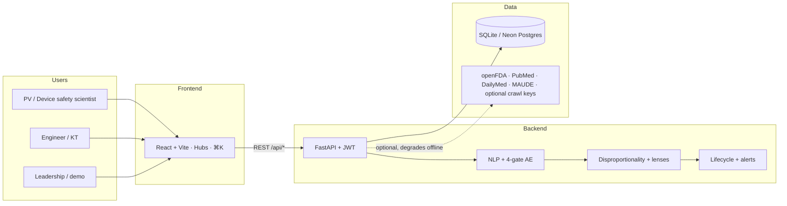
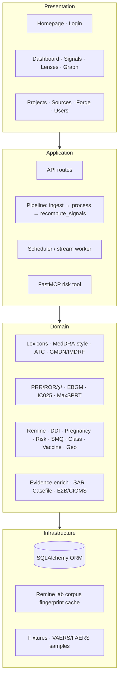
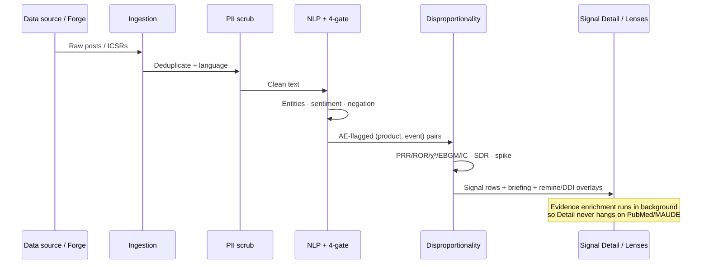
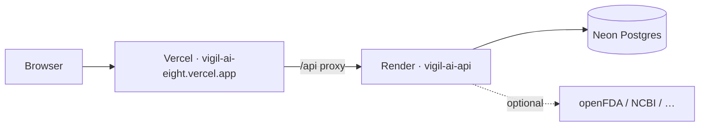

# VigilAI — Application Handbook

> **Who this is for:** anyone joining a demo, onboarding, investor walkthrough, or clinical-ops review who needs the *where / how / what / why* of VigilAI in one place.  
> **How to use:** §6 (hubs) + **§7 step-by-step for every major feature** + §12 keyword packs.  
> **Live app:** https://vigil-ai-eight.vercel.app · **API:** https://vigil-ai-api.onrender.com  
> **Default login:** `admin@vigilai.dev` / `admin123` (also `analyst@…` / `viewer@…` — see §3)  
> **Companion docs:** `README.md` (slide map) · `ARCHITECTURE.md` · `DEMO_SCRIPT.md` · `DEPLOY_FREE.md` · deeper panel lore in `FEATURE_USAGE_GUIDE.md`

---

## Quick keyword index (find anything fast)

Use these terms in **Ctrl+F**, the in-app **⌘K / Ctrl+K** palette, or the **Projects → keywords** field.

| You want… | Search / say | Go to |
|-----------|--------------|-------|
| Main signal table | `Detect`, `SDR`, `PRR` | `/signals` |
| Plain-English “what’s going on” | `briefing`, `Signal Detail` | Click any signal row |
| Competition bias / remine | `Remine`, `masking`, `unmask` | `/lenses?tab=remine` |
| High-risk patient segments | `risk populations`, `comorbidity` | `/lenses?tab=risk` |
| Drug–drug interactions | `DDI`, `polypharmacy` | `/lenses?tab=ddi` |
| Pregnancy / teratogen | `pregnancy`, `congenital` | `/lenses?tab=pregnancy` |
| Syndrome pools | `SMQ` | `/lenses?tab=smq` |
| ATC class read-across | `class effects` | `/lenses?tab=class` |
| Vaccine AESI | `vaccine`, `Brighton`, `AESI` | `/lenses?tab=vaccine` |
| Geography | `geo`, `spatial` | `/lenses?tab=spatial` |
| Social vs FDA | `FAERS`, `divergence` | `/lenses?tab=divergence` |
| Knowledge graph | `graph`, `story` | `/graph` |
| Load demo data | `PV demo pack`, `FAERS bulk`, `VAERS` | `/sources` |
| Narrow what Pathfinder finds | `keywords`, `project` | `/projects` |
| Synthetic stress data | `Forge` | `/forge` |
| Export ICSR | `E2B`, `CIOMS`, `SAR` | Signal Detail |

**Demo jump products** (type into Signals search): `warfarin`, `rivaroxaban`, `semaglutide`, `paroxetine`, `lithium`, `coronary stent`, `catheter`, `pacemaker`, `MMR`, `covid-19 mrna vaccine`.

---

## Table of contents

1. [What VigilAI is (and is not)](#1-what-vigilai-is-and-is-not)
2. [Why it exists](#2-why-it-exists)
3. [Who can use it (roles)](#3-who-can-use-it-roles)
4. [Architecture (diagrams)](#4-architecture-diagrams)
5. [End-to-end data journey](#5-end-to-end-data-journey)
6. [How to use the app (by hub)](#6-how-to-use-the-app-by-hub)
7. [How to use each feature (step by step)](#7-how-to-use-each-feature-step-by-step)
8. [Feature catalog (what / why / where)](#8-feature-catalog-what--why--where)
9. [Signal science (how numbers work)](#9-signal-science-how-numbers-work)
10. [NLP & 4-gate AE engine](#10-nlp--4-gate-ae-engine)
11. [Project keywords for swift retrieval](#11-project-keywords-for-swift-retrieval)
12. [Compiled keyword packs (copy/paste)](#12-compiled-keyword-packs-copypaste)
13. [Data sources & network honesty](#13-data-sources--network-honesty)
14. [Exports & compliance surfaces](#14-exports--compliance-surfaces)
15. [How to run & deploy](#15-how-to-run--deploy)
16. [Repo map (for engineers)](#16-repo-map-for-engineers)
17. [Disclaimers](#17-disclaimers)
18. [Glossary](#18-glossary)

---

## 1. What VigilAI is (and is not)

**VigilAI** is an **offline-first pharmacovigilance (PV) and device-vigilance platform**. It listens to unstructured patient and regulatory chatter (forums, news, FAERS/VAERS-style reports, labels, device alerts), extracts clinical entities, validates adverse-event candidates with an **explainable 4-gate engine**, computes **disproportionality** (PRR / ROR / χ² / EBGM / BCPNN), overlays analytic lenses (remine, DDI, pregnancy, risk populations…), and pushes signals through a **GVP-shaped workflow** with demo **E2B / CIOMS / SAR** exports.

| It is | It is not |
|-------|-----------|
| A working prototype for demos, KT, and architecture review | A validated regulatory submission system |
| Drugs **and** vaccines **and** medical devices | US-only or drug-only |
| Offline-capable (every network path has a fallback) | Dependent on paid LLM / API keys |
| Transparent about surrogates (VigiBase, Sentinel…) | A live feed from licensed WHO VigiBase bulk |

**Product types:** drug · vaccine · device / combination product.

**Design rule:** no feature may hard-require an API key. Optional keys unlock richer crawl / LLM; the core path stays deterministic.

---

## 2. Why it exists

Pre-market trials are **small and short**. Rare and late harms often appear first in **conversation** (Reddit, forums, news, device complaint narratives) before structured ICSRs catch up. VigilAI exists to:

1. **Hear** that chatter worldwide (with PII scrubbing).  
2. **Turn it into clinical concepts** (MedDRA-style PT/SOC, ATC, GMDN/IMDRF).  
3. **Decide “is this an AE?”** with gates you can audit.  
4. **Rank associations** with regulator-shaped stats, not vibes.  
5. **Stress-test** signals (remine, DDI, pregnancy, risk strata).  
6. **Hand off** to review workflow and demo exports.

Grounding literature / policy intent (design, not claims of certification): Trontell 2004 (prepared mind for rare ADRs); Hauben 2007 (DMA + clinical validation on sparse data); FDAAA / Cures Act (active multi-center surveillance, RWE); Downing et al. (post-market safety events for novel therapeutics → risk-weight biologics, accelerated approvals, psychotropics, Class III devices).

---

## 3. Who can use it (roles)

| Role | Default account | Can do |
|------|-----------------|--------|
| **Admin** | `admin@vigilai.dev` / `admin123` | Everything — users, ingest, reset, deploy ops |
| **Analyst** | `analyst@vigilai.dev` / `analyst123` | Analytics, review, lifecycle, Forge, Projects, Pathfinder |
| **Viewer** | `viewer@vigilai.dev` / `viewer123` | Read signals / lenses / exports; remine sensitivity is read-only |

JWT + RBAC on API and UI. Public surfaces: homepage `/`, login `/login`.

---

## 4. Architecture (diagrams)

### 4.1 System context



### 4.2 Layered architecture



### 4.3 Signal pipeline (happy path)



### 4.4 Remine (competition-bias) — conceptual 2×2

```
Before unmasking (full corpus):

                 Event X     Other events
  Product A         a             b
  Others            c             d

  PRR = (a/(a+b)) / (c/(c+d))

After case-level unmasking (drop whole reports that mention masker M):

  Same table rebuilt on residual cases.
  MR = PRR_after / PRR_before
     = coreporting_term × comparator_term

  • comparator_term — classical masking (shared by every product on event X)
  • coreporting_term — pair-specific (target's cases overlapped M)
  • Actionable outcome — pair crosses signalling threshold after unmask
```

### 4.5 Deploy topology (current free-tier)



Cold start on free Render: wake `/api/health` once (~30–60s) before a demo.

---

## 5. End-to-end data journey

| Step | What happens | Why |
|------|--------------|-----|
| 1. Ingest | Crawl catalog, live stream, Pathfinder-approved sources, Forge, or **Load PV demo pack** | Get real / realistic text into the workspace |
| 2. Scrub | Regex (+ optional Presidio) removes PII before DB | Privacy; never echo identity strings |
| 3. NLP | Drugs→generic/ATC; symptoms→MedDRA-style PT/SOC; devices→GMDN/IMDRF | Comparable coding for stats |
| 4. 4-gate AE | Product · symptom · negative sentiment · non-negated | Explainable “is this an AE?” |
| 5. Recompute | Aggregate pairs → PRR/ROR/χ²/EBGM/IC · strength · SDR · spikes | Regulator-shaped ranking |
| 6. Lenses | Remine, DDI, pregnancy, risk, SMQ… | Sensitivity / special populations — **do not overwrite** stored SDR |
| 7. Evidence | PubMed / DailyMed / recalls / MAUDE (background) | Corroborate, don’t block UI |
| 8. Workflow | Inbox → looking into it → … → done / not a concern | Ops ownership |
| 9. Export | SAR PDF/MD · E2B R2/R3 · CIOMS I (demo templates) | Hand-off story |

---

## 6. How to use the app (by hub)

### 6.1 First 5 minutes (recommended path)

1. Open https://vigil-ai-eight.vercel.app → **Login**.  
2. Header: confirm project (**General Pharmacovigilance** is the default).  
3. **Data Sources** → **Load PV demo pack** (if Remine/DDI/Pregnancy look empty).  
4. **Safety Signals → Detect** → type `warfarin` or `semaglutide` in the jump box → open a row.  
5. Read the **plain-English briefing** at the top, then scroll to gates / DMA / remine.  
6. **Lenses → Remine lab** → filter **Needs review** → Run remine on warfarin / haemorrhage.  
7. Optional: **Evidence Explorer** graph → pick the same product–event.

### 6.2 Navigation map

| Hub | Route | Tabs | Use it when… |
|-----|-------|------|----------------|
| Homepage | `/` | — | Marketing / wake API before login |
| Dashboard | `/dashboard` | Corpus · Ops KPIs | Volume, AE rate, triage quality |
| Safety Signals | `/signals` | Detect · Workflow · Alerts | Find → manage → escalate |
| Analytic Lenses | `/lenses` | Predictive intel · Remine · Risk · DDI · Pregnancy · SMQ · Class · Vaccine · Geo · vs FAERS | Stress-test, special-population, and Phase 1–2 intel views |
| Evidence Explorer | `/graph` | Graph · Story · Glossary | Relationships & patient-slang → PT |
| Projects | `/projects` | — | Create workspaces + **keywords** for Pathfinder |
| Source Discovery | `/source-queue` | Pathfinder · Manual URL | Find / approve communities |
| Data Sources | `/sources` | Catalog · Live · Networks · Agent | Crawl & demo pack |
| Data Forge | `/forge` | — | Synthetic posts (analyst+) |
| Users | `/users` | — | Admin only |

**Shortcuts:** `⌘K` / `Ctrl+K` · header project switcher · **Sources → Fetch** (analyst+) · **Reset** (admin — avoid mid-demo).

Legacy URLs (`/lifecycle`, `/alerts`, `/smq`, …) redirect into the hubs above.

### 6.3 Signal Detail — what non-technical readers should look at first

1. **Briefing card** — worry level, why bullets, glossary, next-step buttons.  
2. **Supporting posts** — gate checkmarks (why it counted as an AE).  
3. **Disproportionality strip** — PRR / IC025 / EB05 / strength / SDR.  
4. **Competition-bias remine** — only when peers share the event.  
5. **SAR / E2B / workflow** — “what would we do next.”

Evidence (PubMed etc.) may say “pending” briefly — enrichment is backgrounded so device signals (e.g. coronary stent) no longer hang forever.

---

## 7. How to use each feature (step by step)

Each recipe: **where → clicks → what you should see → what to say / watch for**.

### 7.1 Dashboard — Corpus metrics

1. Open **Dashboard** (`/dashboard`).  
2. Stay on **Corpus metrics**.  
3. Read totals: posts, AE rate, platforms, top drugs/events, charts.  
4. Click an AE / product bar if linked — it deep-links into **Detect** with a filter.  

**Say:** “This is volume and yield — not yet a regulatory decision.”

### 7.2 Dashboard — Ops KPIs

1. Switch to **Ops KPIs & SPC**.  
2. Look at review backlog, time-to-decision, completeness, alert-frequency SPC.  

**Say:** “Ops quality of the safety team, not just science.”

### 7.3 Safety Signals — Detect

1. Open **Safety Signals → Detect**.  
2. In the **jump box**, type a product (`warfarin`, `semaglutide`, `coronary stent`) and press Enter (optional second box for event).  
3. Use strength / product-type / region / SDR / spike filters as needed.  
4. Sort by **PRR**, **EB05**, or **IC025** depending on the story.  
5. Click a **row** → Signal Detail.  

**Clear filters** with the Clear control on the search box when done.  
**Gotcha:** empty table after a weird filter combo — clear search + set strength to ALL.

### 7.4 Signal Detail (full walk)

1. From Detect, open any row.  
2. **Briefing card (top)** — worry level, why bullets, glossary, next-step buttons (scroll to posts / remine / workflow, or export SAR).  
3. **Header** — product → event; spike dot if rising.  
4. **Badge strip** — strength, SDR, WHO-UMC, severity, device/drug badges.  
5. **Disproportionality** — PRR / ROR / χ² / EB05 / IC025 / expected vs observed.  
6. **Supporting posts** — expand a post; check gate ✓/✕ (product, symptom, sentiment, negation).  
7. **Competition-bias remine** (if peers share the event) — select maskers → **Remine** → read before/after PRR and interpretation.  
8. **Casefile / trajectory** — how the signal moved over time (when present).  
9. **Evidence** — PubMed / labels / recalls (may load a few seconds later).  
10. **Exports** — SAR PDF/MD, E2B R2/R3, CIOMS.  
11. **Workflow panel** — assign state (Inbox → Looking into it → …).  

**Say for non-tech:** start at the briefing; only open stats if asked.  
**Gotcha:** first open of a heavy device signal may show evidence “pending” — wait or soft-refresh; page should not spin forever.

### 7.5 Safety Signals — Workflow

1. Open **Safety Signals → Workflow**.  
2. Drag or move cards across kanban columns (Inbox → Looking into it → … → Done / Not a concern).  
3. Open a card to jump back to Signal Detail.  

**Say:** “Same lifecycle states as on the detail page — team ownership.”

### 7.6 Safety Signals — Alert inbox

1. Open **Safety Signals → Alert inbox**.  
2. Scan spike / strong / high-severity pings.  
3. Actions: **Escalate** / **Investigate** / **False alarm** (as available).  

**Gotcha:** Escalate ≠ the same as only changing workflow column — show both if asked about ops.

### 7.7 Remine lab

1. **Lenses → Remine lab** (`/lenses?tab=remine`).  
2. Optional: click **What is this?** for dataset / method.  
3. Search (`warfarin`, `haemorrhage`) or filter chips: **Needs review**, **Crosses threshold**, **≥3 cases**, **Devices**.  
4. Sort by Impact / Co-reporting / Count.  
5. On a card, click **Run remine now** — read interpretation + PRR / IC025 before→after.  
6. **Open signal →** for SAR / lifecycle.  
7. If almost empty: **Load PV demo pack**.  

**Say:** “Read-only sensitivity — Detect baselines are not overwritten. Judge threshold crossing, not raw PRR rise.”  
**Outcomes:** see §9.2 (`unmasked`, `co_reported`, `amplified`, …).

### 7.8 Risk populations

1. **Lenses → Risk populations**.  
2. Enter a **product** and **target AE** (e.g. product from Detect, AE PT).  
3. Click **Predict segments** (adjust min confidence if shown).  
4. Read high-risk segments: predicted risk, relative elevation, contributing factors (age / sex / comorbidity).  

**Say:** “Proactive strata — who might be hurt *before* the next severe case piles up.”  
**Gotcha:** thin corpus → few segments; load demo pack or Forge then recompute.

### 7.9 DDI findings

1. **Lenses → DDI findings**.  
2. Scan co-mentioned drug pairs + shared event + risk flag.  
3. Click **Open signal** or **Find in Detect** to land on a real pair.  

**Say:** “Polypharmacy co-mention vs chance — not a full PBPK interaction engine.”  
**If empty:** Load PV demo pack (FAERS bulk includes polypharmacy-style ICSRs).

### 7.10 Pregnancy

1. **Lenses → Pregnancy**.  
2. Review exposure + congenital / perinatal findings.  
3. Follow **Open signal** / **Find in Detect** (`lithium` + congenital terms work well after demo pack).  

**Say:** “Special-population lens — teratogen / perinatal stratum.”

### 7.11 SMQ syndromes

1. **Lenses → SMQ**.  
2. Pick a syndrome (or leave all).  
3. See member PTs pooled — does the *syndrome* light up when single PTs look weak?  
4. Jump to Detect / Detail from a member row when linked.  

**Say:** “Fragmented reporting of one clinical concept across many PTs.”

### 7.12 Class effects

1. **Lenses → Class effects**.  
2. Pick an ATC class / event view.  
3. Ask: same event across the class, or one product standing out?  

**Say:** “Class vs product — labeling / REMS implications differ.”

### 7.13 Vaccine

1. **Lenses → Vaccine**.  
2. Filter AESI / Brighton-style focus if offered.  
3. Open a vaccine→event into Detect (e.g. myocarditis after COVID mRNA in demo data).  

**Say:** “Vaccine safety lens on top of the same DMA core.”

### 7.14 Geo clusters

1. **Lenses → Geo clusters**.  
2. Look for regions with concentration beyond expected share.  
3. Drill into the product–event if linked.  

**Say:** “Spatial clustering — hypothesis for quality / batch / reporting artifact.”

### 7.15 vs FAERS (divergence)

1. **Lenses → vs FAERS**.  
2. Compare social / corpus signal pattern vs openFDA FAERS (or offline KB fallback).  
3. Note agree / diverge — not automatic truth.

### 7.16 Evidence Explorer — Graph

1. Open **Evidence Explorer** (`/graph`).  
2. Filter product / event.  
3. Click a node/edge → inspector.  
4. Use **Signal Story Mode** (isolate → contrast) when available.  

**Say:** “Relationships at a glance — then validate on Signal Detail.”

### 7.17 Evidence Explorer — Compare story & Glossary

1. Tab **Compare story** — guided A-vs-B narrative for an event.  
2. Tab **Glossary** — patient slang → MedDRA-style PT (show “what patients say”).

### 7.18 Projects + keywords

1. **Projects**.  
2. Create workspace: name, slug, therapeutic area.  
3. Click a **keyword pack** chip (or type 3–8 comma-separated terms).  
4. **Create project** → select it in the **header** switcher.  
5. **Fill workspace** if post count is 0.  
6. Go to **Source Discovery → Run Pathfinder** (keywords drive the search intent).  

**Verify:** Pathfinder suggestions and later Detect search reflect the pack (e.g. `warfarin` pack → haemorrhage pairs).

### 7.19 Source Discovery

1. **Source Discovery**.  
2. Tab **Pathfinder**: **Run Pathfinder** → review suggested URLs → **Approve** / Reject.  
3. Tab **Manual URL**: paste a forum URL → onboard / sample extract (selectors proposed).  

**Gotcha:** JS-heavy forums may return low confidence — that honesty is correct.

### 7.20 Data Sources — Catalog & PV demo pack

1. **Data Sources → Catalog**.  
2. Prefer **fast** tiles for demos (News, FAERS, VAERS, PubMed, MAUDE, MHRA…).  
3. Click **Load PV demo pack** once per workspace when Remine/DDI/Pregnancy need peers.  
4. Wait for ingest + recompute; then reopen Lenses / Detect.  

**Avoid mid-demo:** slow Reddit/Twitter/YouTube unless the network story is the point.

### 7.21 Data Sources — Live stream · Networks · Agent

1. **Live stream** — start timed continuous ingest (server-side); watch counts rise.  
2. **Networks** — live connectors vs **surrogate** slots (VigiBase/Sentinel…) — architecture honesty.  
3. **Agent chat** — natural language → crawl dispatch (login required).

### 7.22 Data Forge

1. **Data Forge** (analyst+).  
2. Set drug, condition, platform, region, record count → **Generate**.  
3. Read quality scores; export JSONL/CSV if needed.  

**Gotcha:** Forge output is **synthetic** and not always auto-merged into Detect — say so. Use it for pipeline stress / zero-PHI demos.

### 7.23 Users (admin)

1. **Users** — list / create accounts, change roles (admin / analyst / viewer).

### 7.24 Hero demo scripts (10 minutes)

| Minute | Path | Line to say |
|--------|------|-------------|
| 0–1 | Login + wake health if cold | “Offline-first PV + devices.” |
| 1–2 | Dashboard corpus | “Listening volume.” |
| 2–4 | Detect → search `warfarin` → Detail briefing | “Plain English first.” |
| 4–6 | Gates + PRR/IC025 | “Explainable AE + regulator-shaped stats.” |
| 6–8 | Remine lab → Needs review → Run | “Competition bias sensitivity — baselines untouched.” |
| 8–9 | Optional DDI or Pregnancy | “Special population / polypharmacy overlays.” |
| 9–10 | SAR or E2B download | “Hand-off story — demo template, not a validated gateway.” |

**Device alternate:** Detect → `coronary stent` or `insulin pump` → GMDN/IMDRF + MAUDE evidence.

---

## 8. Feature catalog (what / why / where)

### Core detection

| Feature | What | Why | Where |
|---------|------|-----|-------|
| Detect table | Ranked product→event with PRR, EB05, IC025, SDR, filters, search | Hero triage list | `/signals` |
| Jump search | Type drug / vaccine / device / event | Avoid scrolling 300+ rows | Detect search boxes |
| Signal briefing | Deterministic plain-English summary | Non-technical stakeholders | Top of Signal Detail |
| 4-gate AE | Explainable gates + confidence | Auditability | Supporting posts |
| Disproportionality | PRR/ROR/χ² + Bayesian EBGM/IC | Regulator-shaped ranking | Detail + Detect |
| Spike / MaxSPRT | Time + sequential boundaries | Emerging / repeated-look control | Detail / alerts |
| WHO-UMC cues | Temporal, de/rechallenge… | Causality language | Detail |
| Workflow + alerts | Kanban + inbox actions | Ops ownership | `/signals?tab=…` |

### Analytic lenses (overlays — do **not** overwrite stored SDR)

| Lens | What | Why | Where |
|------|------|-----|-------|
| **Remine lab** | Screens **every** remine-eligible pair; case-level unmask; MR split into co-reporting × comparator; outcomes: unmasked / co_reported / vanished / attenuated / amplified / stable | Competition bias (Pariente / Maignen / ENCePP Ch.11) | `/lenses?tab=remine` |
| **Risk populations** | Logistic (NumPy IRLS; optional sklearn/LGBM) segments by age/sex/comorbidity | Proactive risk mitigation before severe harm | `/lenses?tab=risk` |
| **DDI** | Co-mention pairs vs chance + clinical risk flags | Polypharmacy AE patterns | `/lenses?tab=ddi` |
| **Pregnancy** | Exposure + congenital / perinatal events | Special-population PV | `/lenses?tab=pregnancy` |
| **SMQ** | Pool PTs into syndrome signals | Catch fragmented reporting | `/lenses?tab=smq` |
| **Class effects** | Same event across ATC class | Class vs product signal | `/lenses?tab=class` |
| **Vaccine** | AESI / Brighton-style focus | Vaccine safety lens | `/lenses?tab=vaccine` |
| **Geo** | Spatial concentration vs expected | Cluster detection | `/lenses?tab=spatial` |
| **vs FAERS** | Social signal vs openFDA pattern | Divergence / corroboration | `/lenses?tab=divergence` |

### Evidence & export

| Feature | What | Where |
|---------|------|-------|
| Knowledge graph | Drug ↔ AE force graph + inspector | `/graph` |
| Story mode | Guided A-vs-B narrative | `/graph?tab=story` |
| Glossary | Patient slang → PT | `/graph` glossary tab |
| Casefile trajectory | Snapshots over time | Signal Detail |
| SAR | GVP Module IX–shaped PDF/MD | Signal Detail |
| E2B R2/R3 · CIOMS I | Demo XML / form templates | Signal Detail |

### Workspace ops

| Feature | What | Why |
|---------|------|-----|
| Projects + keywords | Therapeutic workspaces; keywords drive Pathfinder & literature narrowing | Swift, scoped retrieval |
| Pathfinder | Suggest forums/communities from keywords | Source discovery without manual URL hunting |
| PV demo pack | VAERS + FAERS bulk samples + pregnancy/DDI-friendly ICSRs | Instant remine / DDI / pregnancy demos |
| Data Forge | Synthetic narratives + quality loop | Zero-PHI stress testing |
| Network registry | Live connectors vs licensed **surrogates** | Honest architecture |

---

## 9. Signal science (how numbers work)

### 8.1 2×2 disproportionality

| Cell | Meaning |
|------|---------|
| **a** | Target product + target event |
| **b** | Target product + other events |
| **c** | Other products + target event |
| **d** | Rest |

- **PRR** = (a/(a+b)) / (c/(c+d))  
- **ROR** = (a·d) / (b·c)  
- Continuity: **Haldane–Anscombe +0.5** on all cells  
- **χ² (Yates)** for independence  
- **EBGM / EB05** — MGPS-style Bayesian shrinkage (FDA-flavored)  
- **IC / IC025** — BCPNN (UMC-flavored)  
- **SDR** — composite “signal of disproportionate reporting” when any regulator-style criterion fires  

**Strength tiers**

| Tier | Rule |
|------|------|
| STRONG | PRR ≥ 2, χ² ≥ 4, count ≥ 3 |
| MODERATE | PRR ≥ 1.5, count ≥ 2 |
| WEAK | else |

### 9.2 Remine outcomes (read carefully)

| Outcome | Meaning | Demo language |
|---------|---------|---------------|
| `unmasked` | Crosses signalling threshold after removing maskers | “This was genuinely masked — escalate.” |
| `co_reported` | Target’s own rate moves because cases overlapped the masker | “Confounding / shared cases — review.” |
| `vanished` | Pair disappears when masker cases are removed | “Association lived only in shared reports.” |
| `attenuated` | Weakens / drops below threshold | “May have been inflated.” |
| `amplified` | PRR rises only by the **shared** comparator factor | “Expected arithmetic — not pair-specific.” |
| `stable` | No meaningful competition-bias effect | “No remine action.” |

Evidence tiers: **evaluable** (≥3 cases, Evans), **provisional** (2), **exploratory** (1).

Remine is **read-only sensitivity** — Detect table baselines are not overwritten.

### 9.3 Risk populations (proactive strata)

Input: product + target AE PT.  
Features: age bracket, sex, comorbidity vector (lexicon→UMLS/ICD-style cues), severity ordinal.  
Output: predicted risk, relative elevation vs baseline, top contributing factors.  
Also exposed as FastMCP tool `predict_high_risk_populations`.

---

## 10. NLP & 4-gate AE engine

All four gates must pass for `ae_flag = true`:

| Gate | Requirement |
|------|-------------|
| 1 | Product entity present (drug / vaccine / device) |
| 2 | Symptom or malfunction entity present |
| 3 | **Negative** sentiment |
| 4 | Symptom **not** negated |

`ae_confidence ≈ min(0.99, |sentiment| × 0.9 + 0.1)` with full gate traces on supporting posts.

### 10.1 Evidence hierarchy (scale of proof)

Ingested sources are ranked by **confirmatory weight**, not by volume. This is an evidentiary prior for analyst triage — it does **not** rewrite the PRR/ROR 2×2 table (all AE-flagged rows still count equally in DMA).

| Rank | Tier | Examples | Role |
|------|------|----------|------|
| **1st** | Research literature (L1) | PubMed, Europe PMC, Semantic Scholar, Cochrane | Highest confirmatory weight among ingest types |
| **2nd** | Regulatory / ICSR (L2) | FAERS, VAERS, MAUDE, FDA/MHRA notices, DailyMed | Strong for signal detection; reporting bias / incomplete denominators |
| **3rd** | Social / news (L3) | Reddit, X, forums, Google News | Hypothesis-generating / patient voice; seek L1–L2 corroboration |

On **Signal Detail → Source traceability**, posts are sorted L1→L2→L3, labeled with tier badges, and summarised as an **evidence mix** + confirmation level. Thread corroboration confidence is tempered by mean proof weight so social-only cohorts cannot over-claim “Red” confirmation.

Normalization stack (open surrogates — **not** licensed MedDRA/UMLS):

- Drugs → generic + WHO **ATC** (RxNorm when online)  
- Symptoms → MedDRA-style **PT/SOC** (+ hybrid RapidFuzz / embedding match)  
- Devices → **GMDN** / FDA product-code style; failures → **IMDRF**  
- Missingness is kept as a feature (no silent imputation)

### 10.1b Predictive intelligence (Phase 1–2)

Long-term ClairLabs-aligned stack now has a working Phase 1–2 spine:

| Layer | Path | What it does |
|-------|------|--------------|
| Privacy hygiene | `POST /api/privacy/hygiene` | Presidio/regex PII → standardized tokens; `HMAC-SHA256(author, SYSTEM_SALT)`; SHA-256 content dedupe (30-day window) |
| Ingest adapters | `POST /api/ingest/adapters/{faers\|maude\|literature\|reddit\|clinical_notes}` | Modular connectors with hygiene baked in |
| OMOP CDM v5.4 staging | `POST /api/omop/sync`, `GET /api/omop/stats` | `person` / `drug_exposure` / `device_exposure` / `condition_occurrence` (open surrogates) |
| 4-gate NLP engine | `POST /api/nlp/four-gate` | Brand→generic → ontology map → polarity filter → non-negation (+ BioIE P/R/F1 adapter) |
| Feature store (X) | `GET/POST /api/feature-store/matrix` | Product–Event–Cohort vectors: PRR/ROR/χ²/EB05/IC025, demographics, comorbidities, GNN centrality |

**UI:** **Lenses → Predictive intel** (`/lenses?tab=intel`) — feature matrix, 4-gate playground, OMOP sync/stats, privacy hygiene preview, BioIE eval. Feature matrix defaults `include_explainability=false` for speed. Main ingest (`pipeline.ingest_posts`) always applies hygiene + HMAC author hash + 30-day content-hash dedupe.

FastMCP tool: `get_normalized_feature_matrix` (same payload as the feature-store route). Offline-first; not for clinical use.

### 10.2 Product ontology — brand ↔ generic ↔ chemical

A product is rarely reported under one name. VigilAI resolves every mention to a single **product concept** and keeps all three naming tiers, so one drug is not silently split into several weaker signals.

| Tier | Example (paracetamol concept) | Source |
|------|-------------------------------|--------|
| Brand | Tylenol, Dolo 650, Crocin, Calpol, Panadol | curated brand map + RxNorm `BN` when online |
| Generic / INN | paracetamol (preferred), acetaminophen | curated INN/USAN dual crosswalk + RxNorm `IN`/`PIN` |
| Chemical | N-(4-hydroxyphenyl)acetamide | curated ChEBI-style names + ChEBI via EBI OLS4 when online |

Terminology backbone follows Gómez-Pérez et al., *Ontologies in Medicinal Chemistry* — **RxNorm** (brand ↔ ingredient), **ChEBI** (chemical entities), **WHO ATC** (class), with the paper's *ontology matching* problem handled by an authored INN/USAN crosswalk. SNOMED-CT, live UMLS and licensed MedDRA are **not** bundled.

**Behaviour**

- Ingest collapses INN duals onto the preferred label (`acetaminophen` → `paracetamol`, `albuterol` → `salbutamol`), so new posts share one signal key.
- Risk stratification/ranking and Remine search match on the **alias closure**, not raw string equality.
- Disproportionality math is unchanged; the ontology decides *what counts as the same product*, not how PRR is computed.

**Where to use it**

- **Signal Detail → Product ontology** panel: concept ID, ATC/RxCUI/ChEBI, alias chips per tier, and AE posts per name vs pooled.
- API: `GET /api/ontology/resolve?term=`, `GET /api/ontology/expand?term=`, `GET /api/ontology/compare?product=`. Add `&online=true` to enrich with keyless RxNorm/ChEBI; everything works offline without it.

A large gap between the best single name and the pooled count means the safety picture is fragmented across naming and should be reviewed as one concept.

---

## 11. Project keywords for swift retrieval

### What they are

On **Projects → Create workspace**, the field **keywords, comma-separated** stores a JSON list on the project (`keywords_json`). They are **not** a free-text search of the whole internet by themselves — they are the **intent vocabulary** VigilAI uses to retrieve the right sources and literature **fast** for that workspace.

### Where they are consumed

| Consumer | How keywords help |
|----------|-------------------|
| **Pathfinder** (`Source Discovery`) | Builds the search intent: *“patient forums discussing {keywords}…”* → SearXNG / Exa / Tavily / offline seeds |
| **Literature crawls** | Narrows PubMed / Europe PMC–style queries with project product keywords |
| **Workspace identity** | Shown as chips on the project card so teammates know the surveillance focus |
| **Language hint** | Pathfinder infers CJK / regional second passes from keywords + therapeutic area |

### How to write good keywords

1. **3–8 terms** (Pathfinder uses roughly the first 5 in the intent string).  
2. Mix **product / class**, **event / symptom**, and **community language** (*side effect*, *forum*, *adverse reaction*).  
3. Prefer phrases people actually type: `checkpoint inhibitor`, not only `ICI`.  
4. For devices: include both **device class** and **failure mode** (*infusion pump*, *overinfusion*).  
5. Avoid PII, brand-only spam, or single stop-words (`the`, `drug`).  
6. After saving: set the project active in the header → **Source Discovery → Run Pathfinder** → Approve sources → Fetch / Fill workspace.

### Default seeded workspaces

| Project | Keywords |
|---------|----------|
| General Pharmacovigilance | `adverse reaction`, `side effect`, `drug safety`, `pharmacovigilance` |
| Oncology Surveillance | `immunotherapy`, `checkpoint inhibitor`, `chemotherapy side effects`, `oncology forum` |
| Vaccine Monitoring | `vaccine side effects`, `reactogenicity`, `post vaccination`, `immunization` |

---

## 12. Compiled keyword packs (copy/paste)

Paste into **Projects → keywords** (comma-separated). Pick one pack or mix 4–6 terms.

### General PV / social listening
```
adverse reaction, side effect, drug safety, pharmacovigilance, patient forum, MedWatch
```

### Anticoagulants / haemorrhage
```
warfarin, rivaroxaban, apixaban, haemorrhage, bleeding, anticoagulant, INR
```

### Psychiatry / suicidality
```
paroxetine, sertraline, lithium, suicidal ideation, akathisia, SSRI, bipolar forum
```

### Metabolic / GLP-1
```
semaglutide, Ozempic, Wegovy, pancreatitis, gastroparesis, nausea, weight loss drug
```

### Oncology / immunotherapy
```
pembrolizumab, nivolumab, checkpoint inhibitor, immune-related AE, colitis, pneumonitis, oncology forum
```

### Pregnancy / teratogen
```
pregnancy, congenital anomaly, birth defect, teratogen, lithium pregnancy, valproate, neural tube defect
```

### Vaccine / AESI
```
myocarditis, vaccine side effects, reactogenicity, MMR, COVID-19 vaccine, VAERS, immunization
```

### Devices — cardiac / implant
```
pacemaker, coronary stent, defibrillator, lead fracture, device malfunction, MAUDE, implant forum
```

### Devices — diabetes / infusion
```
insulin pump, continuous glucose monitor, CGM, overinfusion, sensor error, infusion set, diabetes device
```

### Devices — respiratory / other
```
CPAP, ventilator, mask leak, endoscope, reprocessing, field safety notice, MHRA
```

### Dermatologic / isotretinoin
```
isotretinoin, Accutane, depression, IBD, dermatology forum, dry skin severe
```

### DDI / polypharmacy demos
```
polypharmacy, drug interaction, warfarin amiodarone, serotonin syndrome, concomitant medication
```

### How to verify a pack worked

1. Create / edit project with the pack → **Create project**.  
2. Select it in the header.  
3. **Source Discovery → Run Pathfinder** — suggested URLs should reflect the pack.  
4. **Fill workspace** or crawl from **Data Sources**.  
5. **Detect** search for a product from the pack (e.g. `warfarin`).

### In-app jump keywords (Signals Detect search)

These are **corpus lookup** strings, not Pathfinder keywords — type them to jump without scrolling:

| Domain | Try these |
|--------|-----------|
| Drugs | `warfarin`, `rivaroxaban`, `semaglutide`, `paroxetine`, `sertraline`, `lithium`, `ibuprofen`, `prednisone` |
| Vaccines | `covid-19 mrna vaccine`, `MMR` |
| Devices | `coronary stent`, `catheter`, `pacemaker`, `insulin pump`, `continuous glucose monitor` |
| Events | `Haemorrhage`, `Fatigue`, `Anxiety`, `Device malfunction`, `Nausea` |

---

## 13. Data sources & network honesty

### One-click catalog (examples)

Fast / demo-friendly: Google News, life-science news, FDA RSS, FAERS live/bulk, VAERS, PubMed, Europe PMC, DailyMed, MHRA devices, MAUDE, device recalls, **Load PV demo pack**.

Slower / key-gated: YouTube, X/Twitter, Reddit direct / Pullpush.

### Live vs surrogate

| Kind | Examples | Reality in VigilAI |
|------|----------|--------------------|
| **Live / free** | openFDA FAERS & MAUDE, PubMed, DailyMed, MHRA FSNs | Real network calls when online; fixtures offline |
| **Surrogate / registry slot** | WHO VigiBase/VigiLyze, FDA Sentinel, NESTcc | Documented as architecture honesty — exploration over *our* corpus, not licensed bulk ingest |

---

## 14. Exports & compliance surfaces

| Export | Shape | Status |
|--------|-------|--------|
| SAR PDF / Markdown | GVP Module IX–inspired signal assessment | Demo template |
| ICH E2B R2 / R3 XML | ICSR electronic exchange | Demo — not a validated gateway |
| CIOMS I | Classic form-style | Demo |
| Audit trail | Role actions logged | Prototype integrity |

Always show the disclaimer (§16) in customer-facing demos.

---

## 15. How to run & deploy

### Live

| Surface | URL |
|---------|-----|
| App | https://vigil-ai-eight.vercel.app |
| API health | https://vigil-ai-api.onrender.com/api/health |
| Proxied health | https://vigil-ai-eight.vercel.app/api/health |

### Local (summary)

```powershell
# Backend
cd backend
python -m venv .venv
.\.venv\Scripts\activate
pip install -r requirements.txt
copy .env.example .env
python -m uvicorn app.main:app --host 127.0.0.1 --port 8001

# Frontend
cd frontend
npm install
npm run dev
```

Open http://localhost:5173. Prefer an existing DB for presentations — do **not** Reset mid-demo.

Deploy notes: Vercel (frontend) · Render Docker free tier (API) · Neon Postgres. See `docs/DEPLOY_FREE.md`.

---

## 16. Repo map (for engineers)

| Area | Path | Role |
|------|------|------|
| API | `backend/app/api/routes.py` | HTTP surface |
| Models | `backend/app/models.py` | ORM |
| Pipeline | `backend/app/pipeline.py` | Process + recompute |
| NLP | `backend/app/nlp/*` | Entities, gates, MedDRA-style |
| Analytics | `backend/app/analytics/*` | DMA, remine, DDI, pregnancy, risk, SAR… |
| Ingestion | `backend/app/ingestion/*` | Crawls, fixtures, bulk SRS |
| Evidence | `backend/app/evidence/*` | Enrichment, registry |
| Projects | `backend/app/projects/*` | Scope, Pathfinder, keywords |
| MCP | `backend/app/mcp/*` | `predict_high_risk_populations` |
| UI pages | `frontend/src/pages/*` | Hubs |
| API client | `frontend/src/api.js` | REST wrappers |

---

## 17. Disclaimers

- Prototype for demonstration and architecture review.  
- Synthetic / demo data is **fictional**.  
- openFDA coverage is **US FAERS / MAUDE** (plus other open feeds as wired).  
- MedDRA coding is an **open surrogate**, not a licensed MedDRA distribution.  
- E2B / CIOMS / SAR are **demo templates**, not validated submission artifacts.  
- **Not for clinical use** and not a substitute for a validated PV system.

---

## 18. Glossary

| Term | Plain meaning |
|------|----------------|
| **AE** | Adverse event |
| **AESI** | Adverse event of special interest (often vaccines) |
| **ATC** | WHO Anatomical Therapeutic Chemical drug class |
| **BCPNN / IC025** | Bayesian confidence propagation; IC lower bound |
| **DMA** | Disproportionality analysis methods |
| **EBGM / EB05** | Empirical Bayes geometric mean; 5% lower bound |
| **GMDN** | Global Medical Device Nomenclature |
| **GVP** | Good Pharmacovigilance Practices (EU) |
| **ICSR** | Individual Case Safety Report |
| **IMDRF** | International Medical Device Regulators Forum terms |
| **MAUDE** | FDA device adverse event database |
| **MedDRA PT/SOC** | Preferred Term / System Organ Class |
| **PRR / ROR** | Proportional Reporting Ratio / Reporting Odds Ratio |
| **Remine** | Recompute DMA after removing competitor (masker) cases |
| **SDR** | Signal of Disproportionate Reporting |
| **SMQ** | Standardised MedDRA Query (syndrome pool) |
| **VAERS** | US vaccine adverse event reporting system |
| **WHO-UMC** | Uppsala Monitoring Centre causality categories |

---

*Document version aligned with Remine corpus-wide screening, Signal briefing, Risk populations, and project keyword packs. For slide-ready bullets see `README.md`; for deploy steps see `DEPLOY_FREE.md`.*
