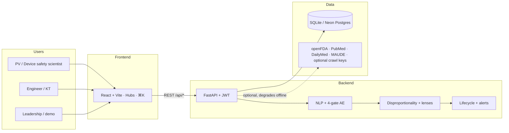
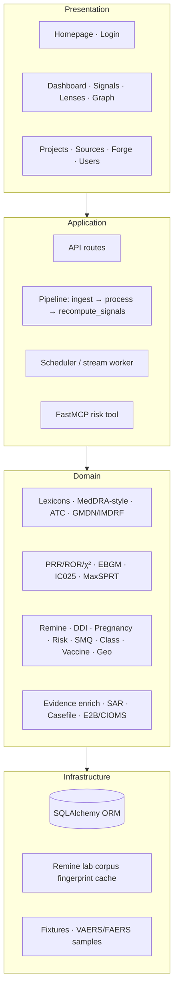
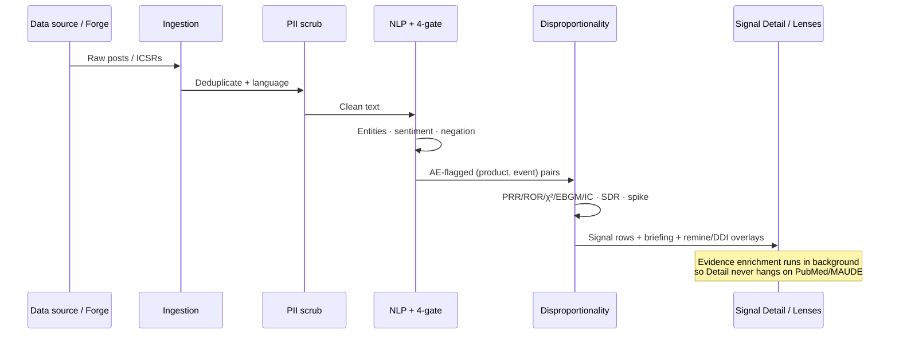
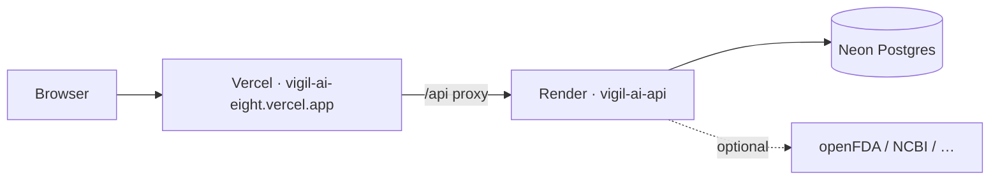
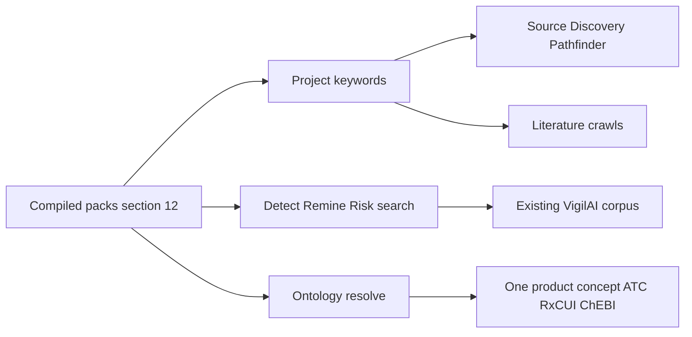

# VigilAI — Application Handbook

> **Who this is for:** anyone joining a demo, onboarding, investor walkthrough, or clinical-ops review who needs the *where / how / what / why* of VigilAI in one place.  
> **How to use:** §6 (hubs) + **§7 step-by-step** + **§9 metrics** + **§19 when output looks empty** + §12 keyword packs.  
> **Live app:** [https://vigil-ai-eight.vercel.app](https://vigil-ai-eight.vercel.app) · **API:** [https://vigil-ai-api.onrender.com](https://vigil-ai-api.onrender.com)  
> **Default login:** `admin@vigilai.dev` / `admin123` (also `analyst@…` / `viewer@…` — see §3)  
> **Companion docs:** `README.md` (slide map) · `ARCHITECTURE.md` · `DEMO_SCRIPT.md` · `DEPLOY_FREE.md` · deeper panel lore in `FEATURE_USAGE_GUIDE.md`

---


## Quick keyword index (find anything fast)

VigilAI uses **three related vocabularies**. Do not mix them up:

| Layer | Purpose | Paste / type **as-is** where? |
|-------|---------|--------------------------------|
| **A. Project keywords** | Enhanced **data retrieval** — Pathfinder finds forums; literature crawls narrow PubMed-style queries | **Projects → keywords** (comma-separated), then activate project + Run Pathfinder |
| **B. Search / jump strings** | Find what’s **already in the corpus** | Detect search, Remine search, ⌘K / Ctrl+K, Risk product/AE boxes, Graph filters |
| **C. Ontology terms** | Same product under many names **and** full coding (MedDRA 5-tier, ATC/ChEBI, GMDN/EMDN) | Signal Detail ontology panels · **Lenses → Ontology** playground · API `ontology/resolve` + `ontology/engine/*` |

Use the table below in **Ctrl+F**, the in-app **⌘K / Ctrl+K** palette, or the **Projects → keywords** field (layer A). Demo product names in layer B work as typed.


| You want…                        | Search / say                              | Go to                                        |
| -------------------------------- | ----------------------------------------- | -------------------------------------------- |
| Main signal table                | `Detect`, `SDR`, `PRR`                    | `/signals`                                   |
| GVP tracking register            | `Register`, `lifecycle`, `PBRER`          | `/signals?tab=register`                      |
| Plain-English conclusions        | `Conclusions`, `briefing`, `Copilot`      | Top of Signal Detail                         |
| Label novel vs in-label          | `label filter`, `Novel`, `Weber`          | Signal Detail hero badges                    |
| Causality draft                  | `WHO-UMC`, `Naranjo`, `causality`         | Signal Detail                                |
| Multi-source agreement           | `triangulation`                           | Signal Detail                                |
| Benefit–risk (PrOACT)            | `PrOACT`, `BRAT`, `benefit–risk`          | Signal Detail (near top)                     |
| Pharmacogenomics                 | `PGx`, `CPIC`, `PharmGKB`                 | Signal Detail PGx card                       |
| Inspection / SLA                 | `inspection`, `SJL`, `overdue`            | `/dashboard?tab=governance`                  |
| FDA COU / credibility            | `COU`, `credibility`, `not validated for` | `/dashboard?tab=governance`                  |
| Competition bias / remine        | `Remine`, `masking`, `unmask`             | `/lenses?tab=remine`                         |
| High-risk patient segments / REM | `REM ranking`, `risk populations`         | `/lenses?tab=risk`                           |
| Predictive feature matrix        | `Predictive intel`, `4-gate`, `OMOP`      | `/lenses?tab=intel`                          |
| Lot / manufacturing              | `lot clustering`, `batch`                 | Signal Detail (when relevant)                |
| Biologic / ATMP delayed toxicity | `longitudinal`, `CRS`, `ICANS`            | Signal Detail (when relevant)                |
| Drug–drug interactions           | `DDI`, `polypharmacy`                     | `/lenses?tab=ddi`                            |
| Pregnancy / teratogen            | `pregnancy`, `congenital`                 | `/lenses?tab=pregnancy`                      |
| Syndrome pools                   | `SMQ`                                     | `/lenses?tab=smq`                            |
| ATC class read-across            | `class effects`                           | `/lenses?tab=class`                          |
| MedDRA hierarchy / ChEBI / GMDN  | `ontology`, `LLT`, `SOC`, `SMILES`, `EMDN` | `/lenses?tab=ontology` + Signal Detail       |
| Brand → chemical Omni-Search     | `Omni-Search`, `Janumet`, `RxE`, `Universe` | `/lenses?tab=omni`                           |
| Organ-class (SOC) disproportion  | `SOC alert`, `organ class`                | `/lenses?tab=ontology`                       |
| Vaccine AESI                     | `vaccine`, `Brighton`, `AESI`             | `/lenses?tab=vaccine`                        |
| Geography                        | `geo`, `spatial`                          | `/lenses?tab=spatial`                        |
| Social vs FDA                    | `FAERS`, `divergence`                     | `/lenses?tab=divergence`                     |
| Knowledge graph                  | `graph`, `story`                          | `/graph`                                     |
| Load demo data                   | `PV demo pack`, `FAERS bulk`, `VAERS`     | `/sources`                                   |
| Narrow what Pathfinder finds     | `keywords`, `project`                     | `/projects`                                  |
| Synthetic stress data            | `Forge`                                   | `/forge`                                     |
| Export ICSR                      | `E2B`, `CIOMS`, `SAR`                     | Signal Detail                                |
| Empty REM / “why nothing?”       | `empty result`, §19                       | [§19](#19-when-you-dont-see-expected-output) |


**Demo jump products** (type into Signals search): `warfarin`, `apixaban`, `paracetamol`, `isotretinoin`, `rivaroxaban`, `semaglutide`, `ondansetron`, `adalimumab`, `coronary stent`, `pacemaker`, `MMR`, `covid-19 mrna vaccine`.

**Best pairs for demos that usually *show* output**


| Goal                              | Open / enter                                                      |
| --------------------------------- | ----------------------------------------------------------------- |
| PGx actionable                    | Signal `warfarin → Haemorrhage`                                   |
| PGx clean screen                  | Signal `apixaban → Haemorrhage`                                   |
| Label + conclusions               | Signal `paracetamol → Hepatic injury` or `apixaban → Haemorrhage` |
| REM ranking with ≥1 stratum       | Risk tab: `paracetamol` + `Hepatic injury` → **Rank strata**      |
| REM empty (teaching “gates held”) | Risk tab: `pacemaker` + `device-related adverse event`            |
| PrOACT balance                    | Any Signal Detail near top (badge **PrOACT-URL / BRAT**)          |
| Ontology playground               | `/lenses?tab=ontology` → map `racing heart` / `Ozempic` / `pacemaker` |
| Omni-Search brand→chemical        | `/lenses?tab=omni` → `Janumet` / `ozmpic` / `Coumadin` |
| Inspection + COU                  | `/dashboard?tab=governance`                                       |


---


## Table of contents

1. [What VigilAI is (and is not)](#1-what-vigilai-is-and-is-not)
2. [Why it exists](#2-why-it-exists)
3. [Who can use it (roles)](#3-who-can-use-it-roles)
4. [Architecture (diagrams)](#4-architecture-diagrams)
5. [End-to-end data journey](#5-end-to-end-data-journey)
6. [How to use the app (by hub)](#6-how-to-use-the-app-by-hub)
7. [How to use each feature (step by step)](#7-how-to-use-each-feature-step-by-step)
8. [Feature catalog (what / why / where)](#8-feature-catalog-what--why--where)
9. [Signal science (how numbers work)](#9-signal-science-how-numbers-work)
10. [NLP & 4-gate AE engine](#10-nlp--4-gate-ae-engine)
11. [Keywords, search strings, and ontologies](#11-keywords-search-strings-and-ontologies)
12. [Compiled keyword packs (copy/paste)](#12-compiled-keyword-packs-copypaste)
13. [Data sources & network honesty](#13-data-sources--network-honesty)
14. [Exports & compliance surfaces](#14-exports--compliance-surfaces)
15. [How to run & deploy](#15-how-to-run--deploy)
16. [Repo map (for engineers)](#16-repo-map-for-engineers)
17. [Disclaimers](#17-disclaimers)
18. [Glossary](#18-glossary)
19. [When you don’t see expected output](#19-when-you-dont-see-expected-output)

---


## 1. What VigilAI is (and is not)

**VigilAI** is an **offline-first pharmacovigilance (PV) and device-vigilance platform**. It listens to unstructured patient and regulatory chatter (forums, news, FAERS/VAERS-style reports, labels, device alerts), extracts clinical entities, validates adverse-event candidates with an **explainable 4-gate engine**, computes **disproportionality** (PRR / ROR / χ² / EBGM / BCPNN), overlays analytic lenses (remine, DDI, pregnancy, risk populations…), and pushes signals through a **GVP-shaped workflow** with demo **E2B / CIOMS / SAR** exports.


| It is                                                      | It is not                                   |
| ---------------------------------------------------------- | ------------------------------------------- |
| A working prototype for demos, KT, and architecture review | A validated regulatory submission system    |
| Drugs **and** vaccines **and** medical devices             | US-only or drug-only                        |
| Offline-capable (every network path has a fallback)        | Dependent on paid LLM / API keys            |
| Transparent about surrogates (VigiBase, Sentinel…)         | A live feed from licensed WHO VigiBase bulk |


**Product types:** drug · vaccine · device / combination product.

**Design rule:** no feature may hard-require an API key. Optional keys unlock richer crawl / LLM; the core path stays deterministic.

---


## 2. Why it exists

Pre-market trials are **small and short**. Rare and late harms often appear first in **conversation** (Reddit, forums, news, device complaint narratives) before structured ICSRs catch up. VigilAI exists to:

1. **Hear** that chatter worldwide (with PII scrubbing).
2. **Turn it into clinical concepts** (MedDRA-style PT/SOC, ATC, GMDN/IMDRF).
3. **Decide “is this an AE?”** with gates you can audit.
4. **Rank associations** with regulator-shaped stats, not vibes.
5. **Stress-test** signals (remine, DDI, pregnancy, risk strata).
6. **Hand off** to review workflow and demo exports.

Grounding literature / policy intent (design, not claims of certification): Trontell 2004 (prepared mind for rare ADRs); Hauben 2007 (DMA + clinical validation on sparse data); FDAAA / Cures Act (active multi-center surveillance, RWE); Downing et al. (post-market safety events for novel therapeutics → risk-weight biologics, accelerated approvals, psychotropics, Class III devices).

---


## 3. Who can use it (roles)


| Role        | Default account                      | Can do                                                           |
| ----------- | ------------------------------------ | ---------------------------------------------------------------- |
| **Admin**   | `admin@vigilai.dev` / `admin123`     | Everything — users, ingest, reset, deploy ops                    |
| **Analyst** | `analyst@vigilai.dev` / `analyst123` | Analytics, review, lifecycle, Forge, Projects, Pathfinder        |
| **Viewer**  | `viewer@vigilai.dev` / `viewer123`   | Read signals / lenses / exports; remine sensitivity is read-only |


JWT + RBAC on API and UI. Public surfaces: homepage `/`, login `/login`.

---


## 4. Architecture (diagrams)


### 4.1 System context




### 4.2 Layered architecture




### 4.3 Signal pipeline




### 4.4 Remine (competition-bias) — conceptual 2×2

```
Before unmasking (full corpus):

                 Event X     Other events
  Product A         a             b
  Others            c             d

  PRR = (a/(a+b)) / (c/(c+d))

After case-level unmasking (drop whole reports that mention masker M):

  Same table rebuilt on residual cases.
  MR = PRR_after / PRR_before
     = coreporting_term × comparator_term

  • comparator_term — classical masking (shared by every product on event X)
  • coreporting_term — pair-specific (target's cases overlapped M)
  • Actionable outcome — pair crosses signalling threshold after unmask
```


### 4.5 Deploy topology (current free-tier)




Cold start on free Render: wake `/api/health` once (~30–60s) before a demo.

---


## 5. End-to-end data journey


| Step              | What happens                                                                             | Why                                                                 |
| ----------------- | ---------------------------------------------------------------------------------------- | ------------------------------------------------------------------- |
| 1. Ingest         | Crawl catalog, live stream, Pathfinder-approved sources, Forge, or **Load PV demo pack** | Get real / realistic text into the workspace                        |
| 2. Scrub          | Regex (+ optional Presidio) removes PII before DB                                        | Privacy; never echo identity strings                                |
| 3. NLP            | Drugs→generic/ATC; symptoms→MedDRA-style PT/SOC; devices→GMDN/IMDRF                      | Comparable coding for stats                                         |
| 4. 4-gate AE      | Product · symptom · negative sentiment · non-negated                                     | Explainable “is this an AE?”                                        |
| 5. Recompute      | Aggregate pairs → PRR/ROR/χ²/EBGM/IC · strength · SDR · spikes                           | Regulator-shaped ranking                                            |
| 6. Lenses         | Remine, DDI, pregnancy, REM risk, SMQ, Predictive intel…                                 | Sensitivity / special populations — **do not overwrite** stored SDR |
| 7. Evidence       | PubMed / DailyMed / recalls / MAUDE (background)                                         | Corroborate, don’t block UI                                         |
| 8. GVP / Register | Label · causality · triangulation · lifecycle queue                                      | Ops tracking (Module IX–shaped)                                     |
| 9. Frontiers      | Inspection SLA · COU · PGx · PrOACT · lot / longitudinal                                 | Governance + specialised overlays                                   |
| 10. Export        | SAR · PBRER · E2B R2/R3 · CIOMS I (demo templates)                                       | Hand-off story                                                      |


---


## 6. How to use the app (by hub)


### 6.1 First 5 minutes (recommended path)

1. Open [https://vigil-ai-eight.vercel.app](https://vigil-ai-eight.vercel.app) → **Login**.
2. Header: confirm project (**General Pharmacovigilance** is the default).
3. **Data Sources** → **Load PV demo pack** (if Remine/DDI/Pregnancy/Register look thin).
4. **Safety Signals → Detect** → type `warfarin` or `paracetamol` → open a row.
5. Read **Conclusions for this signal** first, then the label badge line, then PrOACT, then gates / DMA.
6. **Safety Signals → Register** — see the same signal as a queue row; try a lifecycle action (`→ Looking into it`).
7. **Dashboard → Inspection & COU** — overdue SLAs + “Not validated for” boundaries.
8. **Lenses → Risk populations → REM ranking** — try `paracetamol` + `Hepatic injury` (expect ranked strata) *and* optionally `pacemaker` + device event (expect empty gates — see §19).
9. Optional: **Lenses → Remine lab** → filter **Needs review** → Run remine on warfarin / haemorrhage.


### 6.2 Navigation map


| Hub               | Route           | Tabs                                                                                                  | Use it when…                                                          |
| ----------------- | --------------- | ----------------------------------------------------------------------------------------------------- | --------------------------------------------------------------------- |
| Homepage          | `/`             | —                                                                                                     | Marketing / wake API before login                                     |
| Dashboard         | `/dashboard`    | Corpus · Ops KPIs · **Inspection & COU**                                                              | Volume, triage quality, inspection SLA, COU credibility, module strip |
| Safety Signals    | `/signals`      | Detect · **Register** · Workflow · Alerts                                                             | Find → track (GVP IX) → manage → escalate                             |
| Analytic Lenses   | `/lenses`       | Predictive intel · Remine · **Risk (REM)** · DDI · Pregnancy · SMQ · Class · Vaccine · Geo · vs FAERS | Stress-test, special-population, Phase 1–2 intel                      |
| Evidence Explorer | `/graph`        | Graph · Story · Glossary                                                                              | Relationships & patient-slang → PT                                    |
| Projects          | `/projects`     | —                                                                                                     | Create workspaces + **keywords** for Pathfinder                       |
| Source Discovery  | `/source-queue` | Pathfinder · Manual URL                                                                               | Find / approve communities                                            |
| Data Sources      | `/sources`      | Catalog · Live · Networks · Agent                                                                     | Crawl & demo pack                                                     |
| Data Forge        | `/forge`        | —                                                                                                     | Synthetic posts (analyst+)                                            |
| Users             | `/users`        | —                                                                                                     | Admin only                                                            |


**Shortcuts:** `⌘K` / `Ctrl+K` · header project switcher · **Sources → Fetch** (analyst+) · **Reset** (admin — avoid mid-demo).

Legacy URLs (`/lifecycle`, `/alerts`, `/smq`, …) redirect into the hubs above.

### 6.3 Signal Detail — what non-technical readers should look at first

1. **Conclusions card** — overall verdict (concerning / mixed / reassuring / caution) from the numbers on this signal.
2. **Hero badges + label line** — strength, SDR, WHO-UMC, **label novel vs in-label**.
3. **PrOACT benefit–risk** — does the therapeutic benefit outweigh this AE signal (illustrative).
4. **Inspection readiness** — SLA / overdue for this signal (and SJL export when offered).
5. **Triangulation + causality** — multi-source agreement and WHO-UMC/Naranjo draft.
6. **PGx card** — always present: actionable gene hit *or* “screened, no Level-A match”.
7. **Supporting posts** — gate checkmarks (why it counted as an AE).
8. **Disproportionality strip** — PRR / IC025 / EB05 / strength / SDR.
9. **Lot / longitudinal panels** — only when relevant (lot cues or biologic/ATMP/late-signal).
10. **SAR / E2B / workflow** — “what would we do next.”

Evidence (PubMed etc.) may say “pending” briefly — enrichment is backgrounded so device signals (e.g. coronary stent) no longer hang forever.

---


## 7. How to use each feature (step by step)

Each recipe: **where → clicks → what you should see → what to say / watch for**.

### 7.1 Dashboard — Corpus metrics

1. Open **Dashboard** (`/dashboard`).
2. Stay on **Corpus metrics**.
3. Read totals: posts, AE rate, platforms, top drugs/events, charts.
4. Click an AE / product bar if linked — it deep-links into **Detect** with a filter.

**Say:** “This is volume and yield — not yet a regulatory decision.”

### 7.2 Dashboard — Ops KPIs

1. Switch to **Ops KPIs & SPC**.
2. Look at review backlog, time-to-decision, completeness, alert-frequency SPC.

**Say:** “Ops quality of the safety team, not just science.”

### 7.2b Dashboard — Inspection & COU (governance frontiers)

1. Switch to **Inspection & COU** (`/dashboard?tab=governance`).
2. **Governance modules** strip — six modules with one-line status and where each lives in the app.
3. **Inspection readiness** — open signals, overdue vs SLA (urgent ~14 days for STRONG, routine ~30 days), justification gaps, refresh.
4. **FDA model credibility & Context of Use** — Credibility Index + band; **Validated for (demo scope)** vs the rose **Not validated for — hard boundaries** (each item has *why* + *which human owns it*).
5. **PrOACT sample** at the bottom is a **worked example** on a fixed pair (labelled as such) — open any Signal Detail to run PrOACT on your own product–event.

**Powered by:** portfolio over the VigilAI signal table; BioIE offline surrogate (BC5CDR / NCBI Disease–style) for the credibility scorecard; SLA clocks are GVP Module IX–aligned *teaching* surrogates.

**Say:** “Inspection asks ‘are we late?’ COU asks ‘what is this model allowed to claim?’ Empty overdue list can mean the portfolio is healthy — not that inspection is broken.”  
**Gotcha:** Credibility Index is a prototype scorecard, **not** a SaMD clearance. The four “Not validated for” items are permanent scope boundaries (autonomous ICSR filing, autonomous BR determination, clinical PGx prescribing, replacing QPPV) — we do **not** “validate” into those uses.

### 7.3 Safety Signals — Detect

1. Open **Safety Signals → Detect**.
2. In the **jump box**, type a product (`warfarin`, `semaglutide`, `coronary stent`) and press Enter (optional second box for event).
3. Use strength / product-type / region / SDR / spike / **Novel** / **PGx** filters as needed.
4. Sort by **PRR**, **EB05**, or **IC025** depending on the story.
5. Click a **row** → Signal Detail.

Row chips you may see: SDR · PGx · Novel / In label · MaxSPRT · HR · Calibrated · geo / vaccine / class.  
**Note:** the Detect **Novel** chip is **label novelty**, not PrOACT. PrOACT is on Signal Detail.

**Clear filters** with the Clear control on the search box when done.  
**Gotcha:** empty table after a weird filter combo — clear search + set strength to ALL.

### 7.3b Safety Signals — Register (GVP Module IX tracking)

1. Open **Safety Signals → Register** (`/signals?tab=register`).
2. Read **How this works** — Detect finds signals; Register is the **queue** that tracks them.
3. Scan columns: Product → Event · Strength · **Label badge** · Triangulation · Lifecycle · Priority · Actions.
4. Lifecycle shows plain language (**Inbox**, **Looking into it**, …) plus GVP alias (DETECTION → VALIDATION → CONFIRMATION → …).
5. Click **→ Looking into it** (or next allowed state) to advance; open the product→event link for full Detail.
6. Export **PBRER** (PDF/DOCX) for the portfolio, or per-row **SAR PDF** / **PBRER**.

**Workflow (what the buttons mean)**

```
Inbox → Looking into it → Looks real → High priority → Written up → Done
                         ↘ Not a concern (reject) at most stages
```


| Plain label     | Stored state       | GVP alias      |
| --------------- | ------------------ | -------------- |
| Inbox           | `new`              | DETECTION      |
| Looking into it | `under_evaluation` | VALIDATION     |
| Looks real      | `validated`        | CONFIRMATION   |
| High priority   | `prioritized`      | PRIORITIZATION |
| Written up      | `assessed`         | ASSESSMENT     |
| Done            | `closed`           | CLOSED         |
| Not a concern   | `rejected`         | REJECTED       |


**Powered by:** same VigilAI `Signal` table as Detect (SQL-paginated); label tags from DailyMed / offline label-gap + Weber gate; triangulation from social DMA × openFDA-style regulatory × OMOP staging surrogates; priority from strength × seriousness × novelty × velocity × MaxSPRT weights.

**Say:** “Register is operations. Detail is science. Detect is discovery.”  
**Gotcha:** Register hanging forever was an old full-table load bug — current API pages with `limit`/`offset`. If reject/close asks for notes, a short provisional justification is accepted for demos.  
**Empty?** No signals in project — run Detect / Load PV demo pack.

### 7.4 Signal Detail (full walk)

1. From Detect or Register, open any row (good demos: `warfarin→Haemorrhage`, `apixaban→Haemorrhage`, `paracetamol→Hepatic injury`).
2. **Conclusions for this signal** — bottom-line verdict from PRR / n / calibration / SDR (local, works offline). Optional Ask Q&A.
3. **Hero badges** — strength, SDR, WHO-UMC, spike, **label comparison** + one-line plain reading.
4. **PrOACT benefit–risk** — badge **PrOACT-URL / BRAT**; efficacy vs severe-AE bars; dimensions open by default.
5. **Inspection readiness** (embedded) — lead time vs SLA; Export SJL when offered.
6. **Lot / longitudinal** — appear only when relevant (see §7.4b).
7. **Triangulation matrix** — Social / Regulatory / RWD pillars.
8. **Causality assessment** — WHO-UMC + Naranjo-style draft (human must validate).
9. **PGx card** — always shown (actionable **or** clean screen + CPIC/PharmGKB links).
10. **Supporting posts** — gate ✓/✕.
11. **Disproportionality** — PRR / ROR / χ² / EB05 / IC025.
12. **Competition-bias remine** (if peers share the event).
13. **Exports** — SAR, E2B R2/R3, CIOMS.
14. **Workflow panel** — same states as Register.

**Say for non-tech:** start at Conclusions + label line + PrOACT; open DMA only if asked.

#### 7.4b Lot clustering & longitudinal / delayed-toxicity (conditional panels)


| Panel                               | Where         | When it appears                                                                                                                     | What it means                                                                            |
| ----------------------------------- | ------------- | ----------------------------------------------------------------------------------------------------------------------------------- | ---------------------------------------------------------------------------------------- |
| **Lot / supply-chain**              | Signal Detail | Narratives mention lot/batch/NDC **or** contamination/recall cues **or** manufacturing flag                                         | Concentrated lot → prefer manufacturing investigation; spread lots → product-wide effect |
| **Longitudinal / delayed-toxicity** | Signal Detail | Product is ATMP/CAR-T **or** biologic (INN stems / vaccine) **or** CRS/ICANS-type hits **or** late-year spike in multi-year buckets | Extends surveillance thinking beyond 30–90 days                                          |


**Powered by:** heuristic NLP over supporting post text; optional openFDA enforcement enrich for lots; multi-year buckets from post dates; CRS/ICANS lexicons for ATMPs.

**Gotcha:** most social DOAC/paracetamol signals correctly **hide** these panels — that is success, not a missing feature. See §19.

### 7.5 Safety Signals — Workflow

1. Open **Safety Signals → Workflow**.
2. Drag or move cards across kanban columns (Inbox → Looking into it → … → Done / Not a concern).
3. Open a card to jump back to Signal Detail.

**Say:** “Same lifecycle states as Register and Detail — team ownership.”

### 7.6 Safety Signals — Alert inbox

1. Open **Safety Signals → Alert inbox**.
2. Scan spike / strong / high-severity pings.
3. Actions: **Escalate** / **Investigate** / **False alarm** (as available).

**Gotcha:** Escalate ≠ the same as only changing workflow column — show both if asked about ops.

### 7.7 Remine lab

1. **Lenses → Remine lab** (`/lenses?tab=remine`).
2. Optional: click **What is this?** for dataset / method.
3. Search (`warfarin`, `haemorrhage`) or filter chips: **Needs review**, **Crosses threshold**, **≥3 cases**, **Devices**.
4. Sort by Impact / Co-reporting / Count.
5. On a card, click **Run remine now** — read interpretation + PRR / IC025 before→after.
6. **Open signal →** for SAR / lifecycle.
7. If almost empty: **Load PV demo pack**.

**Say:** “Read-only sensitivity — Detect baselines are not overwritten. Judge threshold crossing, not raw PRR rise.”  
**Outcomes:** see §9.2 (`unmasked`, `co_reported`, `amplified`, …).

### 7.8 Risk populations + REM ranking

1. **Lenses → Risk populations** (`/lenses?tab=risk`).
2. Two modes:
  - **REM ranking** (default) — ranks demographic/comorbidity strata by **Risk Elevation Multiplier**.  
  - **Logistic segments** — predictive segment scores (often still shows cards when REM is empty).
3. Enter **product** + **target AE** (MedDRA-style PT), or click a **candidate pair** chip.
4. Click **Rank strata** (or **Load PV demo** if corpus is thin).

**What REM is**


\mathrm{REM} = \frac{P(\mathrm{AE}\mid \mathrm{Drug}\cap\mathrm{Subpopulation})}{P(\mathrm{AE}\mid \mathrm{Drug}\cap\mathrm{General\ cohort})}


**Gates to appear in the ranked list (default):** REM ≥ **1.5** and Yates χ² ≥ **4.0** (plus enough exposed mass). Strata that fail are **intentionally omitted**.

**Metrics shown under the verdict**


| Field             | Meaning                                                    |
| ----------------- | ---------------------------------------------------------- |
| `n_exposed`       | Drug/device-exposed rows used for the 2×2-within-drug view |
| `baseline P(AE)`  | Overall AE rate among exposed                              |
| `domain`          | `drug` vs `device` (changes mitigation language)           |
| `needs_demo_seed` | Hint that exposure is thin (< ~12) — load demo pack        |


**Demo that shows ranked cards:** `paracetamol` → `Hepatic injury` (often **Region · North America**, REM ≈ 2+).  
**Demo that correctly shows none:** `pacemaker` → `device-related adverse event` with `n_exposed≈9` and high baseline — **no subpopulation cleared the gates**.

**Powered by:** VigilAI processed posts / risk feature strata (age, sex, comorbidity, region lexicons → open UMLS/ICD-style cues); optional sklearn/SHAP when installed, else deterministic attribution; FastMCP `rank_high_risk_populations`.

**Say when empty:** “The ranking ran. No subgroup cleared REM ≥ 1.5 and χ² ≥ 4. With tiny n and a high baseline, we stay silent rather than invent a fragile high-risk segment.” Full script in §19.  
**Gotcha:** chip **N=** counts and `n_exposed` can differ slightly (broader product matching) — both can still be too small for REM.

### 7.9 DDI findings

1. **Lenses → DDI findings**.
2. Scan co-mentioned drug pairs + shared event + risk flag.
3. Click **Open signal** or **Find in Detect** to land on a real pair.

**Say:** “Polypharmacy co-mention vs chance — not a full PBPK interaction engine.”  
**If empty:** Load PV demo pack (FAERS bulk includes polypharmacy-style ICSRs).

### 7.10 Pregnancy

1. **Lenses → Pregnancy**.
2. Review exposure + congenital / perinatal findings.
3. Follow **Open signal** / **Find in Detect** (`lithium` + congenital terms work well after demo pack).

**Say:** “Special-population lens — teratogen / perinatal stratum.”

### 7.11 SMQ syndromes

1. **Lenses → SMQ**.
2. Pick a syndrome (or leave all).
3. See member PTs pooled — does the *syndrome* light up when single PTs look weak?
4. Jump to Detect / Detail from a member row when linked.

**Say:** “Fragmented reporting of one clinical concept across many PTs.”

### 7.12 Class effects

1. **Lenses → Class effects**.
2. Pick an ATC class / event view.
3. Ask: same event across the class, or one product standing out?

**Say:** “Class vs product — labeling / REMS implications differ.”

### 7.13 Vaccine

1. **Lenses → Vaccine**.
2. Filter AESI / Brighton-style focus if offered.
3. Open a vaccine→event into Detect (e.g. myocarditis after COVID mRNA in demo data).

**Say:** “Vaccine safety lens on top of the same DMA core.”

### 7.14 Geo clusters

1. **Lenses → Geo clusters**.
2. Look for regions with concentration beyond expected share.
3. Drill into the product–event if linked.

**Say:** “Spatial clustering — hypothesis for quality / batch / reporting artifact.”

### 7.15 vs FAERS (divergence)

1. **Lenses → vs FAERS**.
2. Compare social / corpus signal pattern vs openFDA FAERS (or offline KB fallback).
3. Note agree / diverge — not automatic truth.


### 7.16 Evidence Explorer — Graph

1. Open **Evidence Explorer** (`/graph`).
2. Filter product / event.
3. Click a node/edge → inspector.
4. Use **Signal Story Mode** (isolate → contrast) when available.

**Say:** “Relationships at a glance — then validate on Signal Detail.”

### 7.17 Evidence Explorer — Compare story & Glossary

1. Tab **Compare story** — guided A-vs-B narrative for an event.
2. Tab **Glossary** — patient slang → MedDRA-style PT (show “what patients say”).


### 7.18 Projects + keywords

1. **Projects**.
2. Create workspace: name, slug, therapeutic area.
3. Click a **keyword pack** chip (or type 3–8 comma-separated terms).
4. **Create project** → select it in the **header** switcher.
5. **Fill workspace** if post count is 0.
6. Go to **Source Discovery → Run Pathfinder** (keywords drive the search intent).

**Verify:** Pathfinder suggestions and later Detect search reflect the pack (e.g. `warfarin` pack → haemorrhage pairs).

### 7.19 Source Discovery

1. **Source Discovery**.
2. Tab **Pathfinder**: **Run Pathfinder** → review suggested URLs → **Approve** / Reject.
3. Tab **Manual URL**: paste a forum URL → onboard / sample extract (selectors proposed).

**Gotcha:** JS-heavy forums may return low confidence — that honesty is correct.

### 7.20 Data Sources — Catalog & PV demo pack

1. **Data Sources → Catalog**.
2. Prefer **fast** tiles for demos (News, FAERS, VAERS, PubMed, MAUDE, MHRA…).
3. Click **Load PV demo pack** once per workspace when Remine/DDI/Pregnancy need peers.
4. Wait for ingest + recompute; then reopen Lenses / Detect.

**Avoid mid-demo:** slow Reddit/Twitter/YouTube unless the network story is the point.

### 7.21 Data Sources — Live stream · Networks · Agent

1. **Live stream** — start timed continuous ingest (server-side); watch counts rise.
2. **Networks** — live connectors vs **surrogate** slots (VigiBase/Sentinel…) — architecture honesty.
3. **Agent chat** — natural language → crawl dispatch (login required).


### 7.22 Data Forge

1. **Data Forge** (analyst+).
2. Set drug, condition, platform, region, record count → **Generate**.
3. Read quality scores; export JSONL/CSV if needed.

**Gotcha:** Forge output is **synthetic** and not always auto-merged into Detect — say so. Use it for pipeline stress / zero-PHI demos.

### 7.23 Users (admin)

1. **Users** — list / create accounts, change roles (admin / analyst / viewer).


### 7.24 Hero demo scripts (10 minutes)


| Minute | Path                                         | Line to say                                                |
| ------ | -------------------------------------------- | ---------------------------------------------------------- |
| 0–1    | Login + wake health if cold                  | “Offline-first PV + devices.”                              |
| 1–2    | Dashboard corpus                             | “Listening volume.”                                        |
| 2–4    | Detect → search `warfarin` → Detail briefing | “Plain English first.”                                     |
| 4–6    | Gates + PRR/IC025                            | “Explainable AE + regulator-shaped stats.”                 |
| 6–8    | Remine lab → Needs review → Run              | “Competition bias sensitivity — baselines untouched.”      |
| 8–9    | Optional DDI or Pregnancy                    | “Special population / polypharmacy overlays.”              |
| 9–10   | SAR or E2B download                          | “Hand-off story — demo template, not a validated gateway.” |


**Device alternate:** Detect → `coronary stent` or `insulin pump` → GMDN/IMDRF + MAUDE evidence.

---


## 8. Feature catalog (what / why / where)


### Core detection


| Feature            | What                                                             | Why                              | Where                               |
| ------------------ | ---------------------------------------------------------------- | -------------------------------- | ----------------------------------- |
| Detect table       | Ranked product→event with PRR, EB05, IC025, SDR, filters, search | Hero triage list                 | `/signals`                          |
| Jump search        | Type drug / vaccine / device / event                             | Avoid scrolling 300+ rows        | Detect search boxes                 |
| Signal conclusions | Deterministic good/bad/mixed verdict from loaded numbers         | Non-technical stakeholders       | Top of Signal Detail                |
| Signal briefing    | Plain-English worry level + next steps                           | Same audience                    | Signal Detail                       |
| 4-gate AE          | Explainable gates + confidence                                   | Auditability                     | Supporting posts · Predictive intel |
| Disproportionality | PRR/ROR/χ² + Bayesian EBGM/IC                                    | Regulator-shaped ranking         | Detail + Detect                     |
| Spike / MaxSPRT    | Time + sequential boundaries                                     | Emerging / repeated-look control | Detail / alerts                     |
| WHO-UMC cues       | Temporal, de/rechallenge…                                        | Causality language               | Detail                              |
| Workflow + alerts  | Kanban + inbox actions                                           | Ops ownership                    | `/signals?tab=…`                    |


### GVP Modules 1–4 & Register


| Feature             | What                                                          | Why                                             | Where                                                          |
| ------------------- | ------------------------------------------------------------- | ----------------------------------------------- | -------------------------------------------------------------- |
| **Label filter**    | In-label vs novel vs boxed; Weber gate↑ on launch/media noise | Separate known label text from novel candidates | Signal Detail hero · Register Label column · Detect Novel chip |
| **Causality draft** | WHO-UMC + Naranjo-style automation                            | Structured medical draft for QPPV               | Signal Detail                                                  |
| **Triangulation**   | Social DMA × Regulatory (FAERS/MAUDE) × RWD (OMOP staging)    | Cross-source corroboration                      | Signal Detail · Register column                                |
| **Signal Register** | Paginated GVP IX tracking + lifecycle + SAR/PBRER             | Operational queue                               | `/signals?tab=register`                                        |


### Analytic lenses (overlays — do **not** overwrite stored SDR)


| Lens                       | What                                                                                                                           | Why                                                  | Where                    |
| -------------------------- | ------------------------------------------------------------------------------------------------------------------------------ | ---------------------------------------------------- | ------------------------ |
| **Remine lab**             | Screens remine-eligible pairs; case-level unmask; outcomes unmasked / co_reported / vanished / attenuated / amplified / stable | Competition bias (Pariente / Maignen / ENCePP Ch.11) | `/lenses?tab=remine`     |
| **Risk populations / REM** | REM ranking + logistic segments by age/sex/comorbidity/region                                                                  | Proactive risk mitigation before severe harm         | `/lenses?tab=risk`       |
| **Predictive intel**       | Feature matrix, 4-gate playground, OMOP, privacy hygiene, BioIE                                                                | Phase 1–2 ClairLabs-aligned spine                    | `/lenses?tab=intel`      |
| **Ontology**               | MedDRA LLT→SOC tree, ATC/ChEBI/SMILES card, GMDN/EMDN/SaMD badge, SOC-level disproportionality + alerts                         | Terminology identity + organ-class signal strengthening | `/lenses?tab=ontology` · Signal Detail |
| **Omni-Search**            | Brand→chemical gateway: fuzzy BEL, RxE Has_Ingredient, ATC explorer, Universe vs Subset DMA                                    | International brand harmonisation + formulation contrast | `/lenses?tab=omni` |
| **DDI**                    | Co-mention pairs vs chance + clinical risk flags                                                                               | Polypharmacy AE patterns                             | `/lenses?tab=ddi`        |
| **Pregnancy**              | Exposure + congenital / perinatal events                                                                                       | Special-population PV                                | `/lenses?tab=pregnancy`  |
| **SMQ**                    | Pool PTs into syndrome signals                                                                                                 | Catch fragmented reporting                           | `/lenses?tab=smq`        |
| **Class effects**          | Same event across ATC class                                                                                                    | Class vs product signal                              | `/lenses?tab=class`      |
| **Vaccine**                | AESI / Brighton-style focus                                                                                                    | Vaccine safety lens                                  | `/lenses?tab=vaccine`    |
| **Geo**                    | Spatial concentration vs expected                                                                                              | Cluster detection                                    | `/lenses?tab=spatial`    |
| **vs FAERS**               | Social signal vs openFDA pattern                                                                                               | Divergence / corroboration                           | `/lenses?tab=divergence` |


### Governance frontiers (Inspection · COU · PGx · PrOACT · lot · ATMP)


| Feature                             | What                                                    | Why                                         | Where                                                    |
| ----------------------------------- | ------------------------------------------------------- | ------------------------------------------- | -------------------------------------------------------- |
| **Inspection readiness**            | SLA clocks, overdue, justification gaps, SJL export     | GVP IX inspection-style ops                 | Dashboard Inspection & COU · Signal Detail               |
| **COU + credibility**               | Context of Use boundaries + BioIE Credibility Index     | Declare what the model may / may not claim  | Dashboard Inspection & COU                               |
| **Frontiers strip**                 | Module readiness roll-up                                | One-glance “what’s live where”              | Dashboard Inspection & COU                               |
| **PGx**                             | CPIC/PharmGKB curated gene–drug–reaction match          | Genomically explainable toxicity triage     | Signal Detail (always) · Detect PGx chip when actionable |
| **PrOACT / BRAT**                   | Efficacy vs severe AE balance + 8 PrOACT-URL dimensions | Contextualise signal vs therapeutic benefit | Signal Detail · Dashboard sample                         |
| **Lot clustering**                  | Lot/batch concentration vs systemic toxicity            | Manufacturing vs molecule                   | Signal Detail when relevant                              |
| **Longitudinal / delayed toxicity** | Multi-year windows; CRS/ICANS for ATMP; biologics watch | Late harms beyond short PV windows          | Signal Detail when relevant                              |


### Evidence & export


| Feature             | What                                  | Where                        |
| ------------------- | ------------------------------------- | ---------------------------- |
| Knowledge graph     | Drug ↔ AE force graph + inspector     | `/graph`                     |
| Ontology hetero KG  | Typed edges (ATC, ChEBI, PT→SOC, GMDN) | API `ontology/engine/knowledge-graph` |
| Story mode          | Guided A-vs-B narrative               | `/graph?tab=story`           |
| Glossary            | Patient slang → PT                    | `/graph` glossary tab        |
| Casefile trajectory | Snapshots over time                   | Signal Detail                |
| SAR                 | GVP Module IX–shaped PDF/MD           | Signal Detail · Register     |
| PBRER               | Aggregate / per-signal draft PDF/DOCX | Register · `/api/gvp/pbrer*` |
| E2B R2/R3 · CIOMS I | Demo XML / form templates             | Signal Detail                |


### Workspace ops


| Feature             | What                                                                     | Why                                          |
| ------------------- | ------------------------------------------------------------------------ | -------------------------------------------- |
| Projects + keywords | Therapeutic workspaces; keywords drive Pathfinder & literature narrowing | Swift, scoped retrieval                      |
| Pathfinder          | Suggest forums/communities from keywords                                 | Source discovery without manual URL hunting  |
| PV demo pack        | VAERS + FAERS bulk samples + pregnancy/DDI-friendly ICSRs                | Instant remine / DDI / pregnancy / REM demos |
| Data Forge          | Synthetic narratives + quality loop                                      | Zero-PHI stress testing                      |
| Network registry    | Live connectors vs licensed **surrogates**                               | Honest architecture                          |


---


## 9. Signal science (how numbers work)


### 9.1 2×2 disproportionality


| Cell  | Meaning                       |
| ----- | ----------------------------- |
| **a** | Target product + target event |
| **b** | Target product + other events |
| **c** | Other products + target event |
| **d** | Rest                          |


- **PRR** = (a/(a+b)) / (c/(c+d)) — how much more often this event is reported with this product vs other products  
- **ROR** = (a·d) / (b·c) — reporting odds ratio (similar story, different algebra)  
- Continuity: **Haldane–Anscombe +0.5** on all cells (stabilises small counts)  
- **χ² (Yates)** — independence test; VigilAI strength uses χ² ≥ 4 with PRR ≥ 2 and n ≥ 3 for STRONG  
- **EBGM / EB05** — MGPS-style Bayesian shrinkage; EB05 is the **5% lower bound** (FDA-flavored). High PRR with tiny n often fails EB05  
- **IC / IC025** — BCPNN information component; IC025 is the lower bound (UMC-flavored)  
- **SDR** — composite “signal of disproportionate reporting” when a regulator-style criterion fires  
- **Calibrated / empirical null** — optional survival against negative-control style calibration

**Strength tiers**


| Tier     | Rule                       | Plain reading                      |
| -------- | -------------------------- | ---------------------------------- |
| STRONG   | PRR ≥ 2, χ² ≥ 4, count ≥ 3 | Disproportionate and not a one-off |
| MODERATE | PRR ≥ 1.5, count ≥ 2       | Elevated but thinner               |
| WEAK     | else                       | Watch / insufficient               |


**Conclusions card** combines these with n and calibration into concerning / mixed / reassuring / caution — e.g. huge PRR + n=3 + failed calibration → “loud but fragile.”

### 9.2 Remine outcomes (read carefully)


| Outcome       | Meaning                                                     | Demo language                               |
| ------------- | ----------------------------------------------------------- | ------------------------------------------- |
| `unmasked`    | Crosses signalling threshold after removing maskers         | “This was genuinely masked — escalate.”     |
| `co_reported` | Target’s own rate moves because cases overlapped the masker | “Confounding / shared cases — review.”      |
| `vanished`    | Pair disappears when masker cases are removed               | “Association lived only in shared reports.” |
| `attenuated`  | Weakens / drops below threshold                             | “May have been inflated.”                   |
| `amplified`   | PRR rises only by the **shared** comparator factor          | “Expected arithmetic — not pair-specific.”  |
| `stable`      | No meaningful competition-bias effect                       | “No remine action.”                         |


Evidence tiers: **evaluable** (≥3 cases, Evans), **provisional** (2), **exploratory** (1).

Remine is **read-only sensitivity** — Detect table baselines are not overwritten.

### 9.3 Risk populations & REM ranking

**Logistic segments (Predict segments tab)**  
Input: product + target AE PT.  
Features: age bracket, sex, comorbidity vector (lexicon→UMLS/ICD-style cues), severity ordinal.  
Output: predicted risk, relative elevation vs baseline, top contributing factors.  
Also exposed as FastMCP tool `predict_high_risk_populations`.

**REM ranking (Rank strata tab)**


| Symbol      | Meaning                                                                             |
| ----------- | ----------------------------------------------------------------------------------- |
| REM         | Risk in stratum ÷ risk in general drug-exposed cohort                               |
| Yates χ²    | Independence of AE vs stratum membership among exposed                              |
| Gate        | Default keep if REM ≥ 1.5 **and** χ² ≥ 4                                            |
| Attribution | Which feature (age/sex/comorbidity/region) drove the REM excess                     |
| Mitigation  | Drug → Section 5 / contraindications language; Device → engineering / procedure RCA |


Empty ranked list after a successful run means **gates filtered everything** — see §19. Thin exposure (`n_exposed` < 5 or AE count < 2) returns an insufficient-mass verdict and `needs_demo_seed`.

### 9.4 Label filter & Weber


| Tag / chip              | Meaning                                                                                           |
| ----------------------- | ------------------------------------------------------------------------------------------------- |
| IN-LABEL / ESTABLISHED  | Event appears in surrogate label / DailyMed-style text                                            |
| BOXED                   | Covered by a boxed-warning topic                                                                  |
| NOVEL / OFF-LABEL novel | Not found on the surrogate label — candidate for novelty review                                   |
| WEBER GATE↑             | Launch window or media-spike adjustment **raises alert gates** without rewriting stored PRR cells |


**Data:** curated approval anchors + DailyMed / offline label-gap; not a complete regulatory calendar.

### 9.5 Triangulation


| Pillar            | Typical input                           | Pass idea                             |
| ----------------- | --------------------------------------- | ------------------------------------- |
| Social / News DMA | VigilAI PRR/χ²/strength                 | STRONG or PRR≥2 & χ²≥4 & n≥3          |
| Regulatory        | openFDA FAERS/MAUDE-style corroboration | Known / elevated in regulatory stream |
| RWD               | OMOP staging surrogate                  | Support in structured staging         |


Scores combine into `triangulated_risk_score`, `urgency_tier`, and a badge (e.g. INSUFFICIENT TRIANGULATION when only social is loud).

### 9.6 Causality (WHO-UMC + Naranjo draft)

Deterministic cue scoring (temporal +0.35, dechallenge +0.25, rechallenge +0.30, confounder −0.20, openFDA-known +0.20) → Certain / Probable / Possible / Unlikely / Unassessable. Naranjo-style questions over narrative. **Always a draft** — Possible/Unassessable skew is common when de/rechallenge text is missing (§19).

### 9.7 PGx


| Result             | Meaning                                                                    |
| ------------------ | -------------------------------------------------------------------------- |
| Actionable         | Curated CPIC/PharmGKB row matches **drug + this reaction** (or SOC family) |
| Other associations | Drug has gene links, but not for *this* event                              |
| Clean screen       | No curated Level-A style match                                             |


**Data:** offline table in `pgx.py` (abacavir/HLA-B*57:01, warfarin/CYP2C9–VKORC1, clopidogrel/CYP2C19, ondansetron/CYP2D6, …) + optional live PharmGKB/CPIC HTTP with disk cache. Matching is deliberately **precise** — drug alone does not flag. Not clinical decision support.

### 9.8 PrOACT-URL / BRAT benefit–risk


| Piece                    | Meaning                                                                                                   |
| ------------------------ | --------------------------------------------------------------------------------------------------------- |
| Efficacy / NNT (or NNV)  | Illustrative literature-range benefit from curated offline KB (+ ATC class fallback)                      |
| Severe AE signal % / NNH | Report-derived **proxy** for harm (not incidence)                                                         |
| Balance ratio            | Benefit vs severe-AE framing                                                                              |
| Tone                     | favourable / watch / unfavourable                                                                         |
| PrOACT-URL dimensions    | Problem, Objectives, Alternatives, Consequences, Tradeoffs, Uncertainty, Risk tolerance, Linked decisions |


**Say:** “Illustrative surrogate — safety committee still owns the determination.”

### 9.9 Inspection SLA


| Clock           | Default teaching value                                                       |
| --------------- | ---------------------------------------------------------------------------- |
| Urgent (STRONG) | ~14 days                                                                     |
| Routine         | ~30 days                                                                     |
| Overdue         | Lead time > SLA while still open                                             |
| SJL             | Signal Justification Log (markdown + hashed actions) — prototype audit trail |


### 9.10 Lot clustering coefficient

Share of lot-tagged AE mentions concentrated in the dominant lot (0–1). Manufacturing-style flag when coefficient ≥ ~0.80, enough mentions, and spike or multi-lot evidence. No lot strings in narratives → panel hidden.

---


## 10. NLP & 4-gate AE engine

All four gates must pass for `ae_flag = true`:


| Gate | Requirement                                      |
| ---- | ------------------------------------------------ |
| 1    | Product entity present (drug / vaccine / device) |
| 2    | Symptom or malfunction entity present            |
| 3    | **Negative** sentiment                           |
| 4    | Symptom **not** negated                          |


`ae_confidence ≈ min(0.99, |sentiment| × 0.9 + 0.1)` with full gate traces on supporting posts.

### 10.1 Evidence hierarchy (scale of proof)

Ingested sources are ranked by **confirmatory weight**, not by volume. This is an evidentiary prior for analyst triage — it does **not** rewrite the PRR/ROR 2×2 table (all AE-flagged rows still count equally in DMA).


| Rank    | Tier                     | Examples                                        | Role                                                                  |
| ------- | ------------------------ | ----------------------------------------------- | --------------------------------------------------------------------- |
| **1st** | Research literature (L1) | PubMed, Europe PMC, Semantic Scholar, Cochrane  | Highest confirmatory weight among ingest types                        |
| **2nd** | Regulatory / ICSR (L2)   | FAERS, VAERS, MAUDE, FDA/MHRA notices, DailyMed | Strong for signal detection; reporting bias / incomplete denominators |
| **3rd** | Social / news (L3)       | Reddit, X, forums, Google News                  | Hypothesis-generating / patient voice; seek L1–L2 corroboration       |


On **Signal Detail → Source traceability**, posts are sorted L1→L2→L3, labeled with tier badges, and summarised as an **evidence mix** + confirmation level. Thread corroboration confidence is tempered by mean proof weight so social-only cohorts cannot over-claim “Red” confirmation.

Normalization stack (open surrogates — **not** licensed MedDRA/UMLS):

- Drugs → generic + WHO **ATC** (RxNorm when online)  
- Symptoms → MedDRA-style **PT/SOC** (+ hybrid RapidFuzz / embedding match)  
- Devices → **GMDN** / FDA product-code style; failures → **IMDRF**  
- Missingness is kept as a feature (no silent imputation)


### 10.1c GVP Signal Management OS (Modules 1–4)


| Module                      | UI path                                                                                       | API                                                            | Dataset / engine                                                       |
| --------------------------- | --------------------------------------------------------------------------------------------- | -------------------------------------------------------------- | ---------------------------------------------------------------------- |
| Label filter + Weber gates  | **Signal Detail** hero badge + plain line; Register Label column; Detect Novel/In-label chips | `GET /api/label-filter`                                        | DailyMed / offline label-gap + boxed warnings + curated launch anchors |
| WHO-UMC + Naranjo causality | **Signal Detail** — Causality assessment panel                                                | `POST /api/nlp/causality` · MCP `evaluate_narrative_causality` | Deterministic lexicons over supporting narratives                      |
| Triangulation matrix        | **Signal Detail** card; Register triangulation column                                         | `GET /api/signals/{id}/triangulation`                          | Social DMA + openFDA FAERS/MAUDE surrogates + OMOP staging             |
| GVP IX register + PBRER/SAR | **Safety Signals → Register**                                                                 | `GET /api/gvp/register`, `/api/gvp/pbrer.pdf                   | .docx`, SAR routes                                                     |


All generated SAR/PBRER documents carry an AI-assisted draft disclaimer requiring QPPV/Medical Reviewer validation.

### 10.1d Governance frontiers (Inspection · COU · PGx · PrOACT · lot · ATMP)


| Module                          | UI                                  | API                                                                 | Powered by                                                                 |
| ------------------------------- | ----------------------------------- | ------------------------------------------------------------------- | -------------------------------------------------------------------------- |
| Inspection readiness            | Dashboard Inspection & COU · Detail | `/api/inspection/portfolio`, `/api/inspection/signals/{id}`, `/sjl` | Signal lifecycle timestamps + SLA clocks + justification rules             |
| COU + credibility               | Dashboard Inspection & COU          | `/api/governance/cou`, `/credibility`                               | Declared COU + offline BioIE P/R/F1 → Credibility Index                    |
| Frontiers strip                 | Dashboard Inspection & COU          | `/api/frontiers/summary`                                            | Roll-up of inspection + credibility + module descriptors                   |
| PGx                             | Signal Detail always-on card        | `/api/signals/{id}/pgx-profile`, `/api/pgx/associations`            | Curated CPIC/PharmGKB table + optional live APIs                           |
| PrOACT / BRAT                   | Signal Detail · Dashboard sample    | `/api/benefit-risk/proact`, `/signals/{id}/benefit-risk-proact`     | Offline benefit KB (NNT/NNV) + report-derived NNH proxy                    |
| Lot clustering                  | Signal Detail if relevant           | `/api/signals/{id}/lot-clustering`                                  | Lot/batch/NDC NLP + optional openFDA enforcement                           |
| Longitudinal / delayed toxicity | Signal Detail if relevant           | `/api/signals/{id}/longitudinal-biologics`                          | Product-name biologic/ATMP class + multi-year buckets + CRS/ICANS lexicons |


MCP tools (when wired): `get_pgx_gene_associations`, `evaluate_benefit_risk_ratio`, `get_inspection_lead_time_metrics`.

### 10.1b Predictive intelligence (Phase 1–2)

Long-term ClairLabs-aligned stack now has a working Phase 1–2 spine:


| Layer                 | Path                                                                       | What it does                                                                                                         |
| --------------------- | -------------------------------------------------------------------------- | -------------------------------------------------------------------------------------------------------------------- |
| Privacy hygiene       | `POST /api/privacy/hygiene`                                                | Presidio/regex PII → standardized tokens; `HMAC-SHA256(author, SYSTEM_SALT)`; SHA-256 content dedupe (30-day window) |
| Ingest adapters       | `POST /api/ingest/adapters/{faers|maude|literature|reddit|clinical_notes}` | Modular connectors with hygiene baked in                                                                             |
| OMOP CDM v5.4 staging | `POST /api/omop/sync`, `GET /api/omop/stats`                               | `person` / `drug_exposure` / `device_exposure` / `condition_occurrence` (open surrogates)                            |
| 4-gate NLP engine     | `POST /api/nlp/four-gate`                                                  | Brand→generic → ontology map → polarity filter → non-negation (+ BioIE P/R/F1 adapter)                               |
| Feature store (X)     | `GET/POST /api/feature-store/matrix`                                       | Product–Event–Cohort vectors: PRR/ROR/χ²/EB05/IC025, demographics, comorbidities, GNN centrality                     |


**UI:** **Lenses → Predictive intel** (`/lenses?tab=intel`) — feature matrix, 4-gate playground, OMOP sync/stats, privacy hygiene preview, BioIE eval. Feature matrix defaults `include_explainability=false` for speed. Main ingest (`pipeline.ingest_posts`) always applies hygiene + HMAC author hash + 30-day content-hash dedupe.

FastMCP tool: `get_normalized_feature_matrix` (same payload as the feature-store route). Offline-first; not for clinical use.

### 10.2 Product ontology — brand ↔ generic ↔ chemical

A product is rarely reported under one name. VigilAI resolves every mention to a single **product concept** and keeps all three naming tiers, so one drug is not silently split into several weaker signals.


| Tier          | Example (paracetamol concept)              | Source                                                     |
| ------------- | ------------------------------------------ | ---------------------------------------------------------- |
| Brand         | Tylenol, Dolo 650, Crocin, Calpol, Panadol | curated brand map + RxNorm `BN` when online                |
| Generic / INN | paracetamol (preferred), acetaminophen     | curated INN/USAN dual crosswalk + RxNorm `IN`/`PIN`        |
| Chemical      | N-(4-hydroxyphenyl)acetamide               | curated ChEBI-style names + ChEBI via EBI OLS4 when online |


Terminology backbone follows Gómez-Pérez et al., *Ontologies in Medicinal Chemistry* — **RxNorm** (brand ↔ ingredient), **ChEBI** (chemical entities), **WHO ATC** (class), with the paper's *ontology matching* problem handled by an authored INN/USAN crosswalk. SNOMED-CT, live UMLS and licensed MedDRA are **not** bundled.

**Behaviour**

- Ingest collapses INN duals onto the preferred label (`acetaminophen` → `paracetamol`, `albuterol` → `salbutamol`), so new posts share one signal key.
- Risk stratification/ranking and Remine search match on the **alias closure**, not raw string equality.
- Disproportionality math is unchanged; the ontology decides *what counts as the same product*, not how PRR is computed.

**Where to use it**

- **Signal Detail → Product ontology** panel: concept ID, ATC/RxCUI/ChEBI, alias chips per tier, and AE posts per name vs pooled.
- API: `GET /api/ontology/resolve?term=`, `GET /api/ontology/expand?term=`, `GET /api/ontology/compare?product=`. Add `&online=true` to enrich with keyless RxNorm/ChEBI; everything works offline without it.

A large gap between the best single name and the pooled count means the safety picture is fragmented across naming and should be reviewed as one concept.

### 10.3 Ontology mapping engine — full terminology identity

§10.2 answers "is this the same product?". The **ontology mapping engine** answers the wider coding question: *given any verbatim span, what is its identity in every terminology a PV or device-vigilance reviewer works in?*

| Verbatim kind | What you get back |
| ------------- | ----------------- |
| Event ("racing heart") | LLT → PT → HLT → HLGT → SOC, plus surrogate CUI / SNOMED-CT / OAE identifiers and optional ICD-11 |
| Drug ("Ozempic") | Preferred ingredient, RxNorm-style ID, ATC L1–L5 ladder with labels, ChEBI ID + SMILES + formula, structural neighbours by Tanimoto |
| Device ("pacemaker", "hybrid closed loop") | GMDN + EMDN codes, FDA product code, FDA class and EU MDR class, implantable and SaMD flags, IMDRF failure-mode code |

**Where the data comes from.** Versioned JSON artifacts in `backend/app/data/ontology/` (`meddra_hierarchy_surrogate`, `atc_tree_surrogate`, `chebi_smiles_surrogate`, `gmdn_emdn_surrogate`, `umls_cui_surrogate`, plus `MANIFEST.json`). The PT/SOC layer is the same surrogate already used for stored signal coding, so the hierarchy can never disagree with what Detect saved. Every response carries `audit.ontology_version`, `audit.is_surrogate: true`, the raw verbatim, and the surrogate disclaimer. Identifiers use explicit prefixes (`CUI-SUR-`, `MEDDRA_SUR:`, `SNOMED_SUR:`, `OAE_SUR:`, `RXNORM:VIG-`) so nothing can be mistaken for a licensed code.

**Where to find it in the app**

| Surface | What it shows |
| ------- | ------------- |
| **Signal Detail → Ontology engine** card | Device taxonomy badge (device signals), chemical identity card with the ATC ladder and SMILES (drug signals), and the MedDRA hierarchy tree for the event |
| **Lenses → Ontology** | Organ-class (SOC) disproportionality table + alerts, and a terminology playground where you can type any verbatim and see how it codes |
| **API** | `GET /api/ontology/engine/map` · `meddra-chain` · `hierarchy` · `drug-chemical` · `device` · `disproportionality` · `knowledge-graph` · `status` |
| **FastMCP** | `map_verbatim_to_full_ontology(verbatim_term, entity_type, failure_mode)` in `app.mcp.risk_server` — returns the same JSON for external AI assistants |

**SOC-level disproportionality.** `analytics/ontological_disproportionality.py` runs the existing PRR / ROR / χ² / EBGM / IC helpers twice: once keyed on the Preferred Term, once with member PTs pooled into their System Organ Class. A `soc_alerts` entry means the organ class cleared SDR gates while no individual PT did — a diffuse class pattern that is easy to dismiss as sparse noise at PT level. It is an overlay for review, not a replacement for the Detect signal table and never auto-escalates.

**Typed knowledge graph.** `graph/knowledge_graph.py` builds a NetworkX heterogeneous graph whose nodes carry an ontology namespace (drug, ATC, ChEBI, MedDRA PT, SOC, device, IMDRF) and whose edges carry a relation: `HAS_ATC_CLASS`, `BELONGS_TO`, `HAS_CHEMICAL_STRUCTURE`, `CAUSES_EVENT`, `MAPPED_TO`. PyTorch Geometric export is attempted only if `torch_geometric` happens to be installed. The older co-occurrence graph in `analytics/knowledge_graph.py` is unchanged and still powers the existing force-directed view.

**If the output looks empty or thin — it is usually data, not a fault**

| What you see | Why | What to do |
| ------------ | --- | ---------- |
| Event shows "unmatched", no PT | The verbatim is outside the ~58 demo chains. The engine deliberately refuses to invent a Preferred Term | Use the playground with a closer clinical wording, or extend `meddra_hierarchy_surrogate.json` |
| Chemical card missing / no SMILES | The ingredient is not in the curated ChEBI demo subset, or it is a biologic (semaglutide, insulin, adalimumab have no small-molecule SMILES) | Expected — structural similarity does not apply to macromolecules |
| "Structural neighbours" empty | Fewer than two molecules in the ATC cohort have SMILES above the 0.15 similarity floor | Not an error; the subset is a teaching slice, not all of ChEBI |
| No SOC alerts | Every disproportionate pattern is already visible at PT level, which is the healthy case | Read the PT table in Detect as usual |
| SOC table empty | No AE-coded signals in the active workspace | Run Ingest → Detect, or load a demo pack |
| Device badge missing | The product is coded as a drug, or the device name is outside the 19 canonical categories + 5 SaMD categories | Check `product_type` on the signal, or extend `gmdn_emdn_surrogate.json` |
| Tanimoto method says `smiles_ngram_surrogate` | RDKit is not installed, so the engine used the deterministic SMILES n-gram fallback | Fine for ranking demos; install RDKit for true ECFP4 fingerprints |

**Not bundled:** licensed MedDRA ASCII, the full UMLS Metathesaurus, SNOMED-CT distributions, and commercial GMDN/EMDN dumps. Everything above is an authored open surrogate, not for regulatory submission.

### 10.4 Omni-Search — brand → chemical + Universe vs Subset

Module 1 of the search stack. **Lenses → Omni-Search** (`/lenses?tab=omni`) runs a five-step offline-first pipeline:

1. **Extract** — PharmaCoNER-style substances + CADEC/SMM4H colloquial ADE surfaces over noisy text  
2. **BEL** — MicroMeSH fuzzy synonym / typo linking → surrogate UMLS CUI  
3. **RxNorm / RxE** — brand RxCUI + `Has_Ingredient` generics (combos like Janumet → sitagliptin + metformin; discontinued brands like Accutane retained)  
4. **ATC / RxClass** — WHO ATC L1–L5 ladder (+ optional live RxClass when `online=true`)  
5. **Universe vs Subset** — chemical-ingredient baseline vs selected manufacturer brands, using OMOP staging when populated and the Signal table otherwise  

| Surface | What it shows |
| ------- | ------------- |
| Search bar + autocomplete | Fuzzy MicroMeSH suggestions (`warfr` → warfarin) |
| Brand → chemical card | Brand RxCUI, UMLS CUI, Has_Ingredient chips, manufacturer / status |
| ATC class explorer | L1–L5 ladder + same-subgroup read-across members |
| Universe vs Subset panel | Checkbox brands; comparative PRR elevation vs chemical baseline |

**Data:** `backend/app/data/search/` (`rxe_extension_surrogate`, `micromesh_synonyms_surrogate`, `cadec_smm4h_colloquial_surrogate`, `pharmaconer_substances_surrogate`).  
**API:** `GET /api/search/omni?q=` · `resolve-brand` · `autocomplete` · `universe-subset` · `status`  
**FastMCP:** `resolve_brand_to_chemical(query_term)`  

**Try:** `Janumet`, `ozmpic`, `Coumadin`, `Eliquis`, or a phrase like `took Janumet and felt sick to my stomach`.

| If you see… | Why | What to do |
| ----------- | --- | ---------- |
| No match / empty ingredients | Term outside RxE + brand lexicons | Try `Janumet` / `Ozempic` / a generic INN |
| Universe reports = 0 | No AE-coded exposures for that chemical in the workspace | Ingest / Load PV demo / `POST /api/omop/sync` |
| Subset empty but Universe filled | No selected brand reports (or brand not in corpus under that surface) | Tick other subset brands; search Detect for the brand |
| Discontinued badge (Accutane) | Historical RxE status — ingredients still resolve | Expected for surveillance of legacy names |

---


## 11. Keywords, search strings, and ontologies

Three tools, three jobs. All of the copy/paste packs in §12 are written so you can use them **as-is** in the place named for that layer.



### 11.1 Layer A — Project keywords (enhanced data retrieval)

**What they are:** On **Projects → Create / edit workspace**, the field **keywords, comma-separated** stores a JSON list (`keywords_json`). They are the workspace **intent vocabulary** for *finding new data and literature faster* — not a Google box over the whole internet by themselves.

**Paste as-is:** any §12 pack into **Projects → keywords**, save, set the project active in the header.

**Where they are consumed**

| Consumer | How keywords help |
|----------|-------------------|
| **Pathfinder** (`/source-queue`) | Builds search intent: *patient forums discussing {keywords}…* → SearXNG / Exa / Tavily / offline seeds |
| **Literature crawls** | Narrows PubMed / Europe PMC–style queries with project product keywords |
| **Fill / Fetch under that project** | Scoped ingest prefers the active workspace |
| **Workspace identity** | Chips on the project card so teammates see the surveillance focus |
| **Language hint** | Pathfinder may add CJK / regional second passes from keywords + therapeutic area |

**How to write good project keywords**

1. **3–8 terms** (Pathfinder uses roughly the first 5 in the intent string).
2. Mix **product / class**, **event / symptom**, and **community language** (*side effect*, *forum*, *adverse reaction*).
3. Prefer phrases people actually type: `checkpoint inhibitor`, not only `ICI`.
4. For devices: **device class** + **failure mode** (*infusion pump*, *overinfusion*).
5. Avoid PII, brand-only spam, or stop-words (`the`, `drug`).
6. After saving: header switcher → **Source Discovery → Run Pathfinder** → Approve → Fetch / Fill workspace.

**Default seeded workspaces**

| Project | Keywords |
|---------|----------|
| General Pharmacovigilance | `adverse reaction`, `side effect`, `drug safety`, `pharmacovigilance` |
| Oncology Surveillance | `immunotherapy`, `checkpoint inhibitor`, `chemotherapy side effects`, `oncology forum` |
| Vaccine Monitoring | `vaccine side effects`, `reactogenicity`, `post vaccination`, `immunization` |

### 11.2 Layer B — Search / jump strings (use as-is in the UI)

These look up **what is already ingested**. Same strings often appear in project packs so you can reuse them after Pathfinder has filled the corpus.

| Where to type | What to paste | Example |
|---------------|---------------|---------|
| **Safety Signals → Detect** jump / search boxes | Product and/or event | `warfarin` · `Haemorrhage` · `pacemaker` |
| **⌘K / Ctrl+K** command palette | Hub or feature name, or product | `Register`, `REM`, `warfarin` |
| **Remine lab** search | Product or event fragment | `warfarin`, `haemorrhage` |
| **Risk populations** product + AE fields | Product INN + MedDRA-style PT | `paracetamol` + `Hepatic injury` |
| **Evidence Explorer** filters | Product / event | same as Detect |
| **Handbook / this doc Ctrl+F** | Feature names from the index | `PrOACT`, `REM ranking` |

**In-app jump strings (Detect)** — corpus lookup, not Pathfinder:

| Domain | Try these |
|--------|-----------|
| Drugs | `warfarin`, `rivaroxaban`, `apixaban`, `paracetamol`, `semaglutide`, `isotretinoin`, `ondansetron`, `paroxetine`, `lithium`, `ibuprofen` |
| Vaccines | `covid-19 mrna vaccine`, `MMR` |
| Devices | `coronary stent`, `catheter`, `pacemaker`, `insulin pump`, `continuous glucose monitor` |
| Events | `Haemorrhage`, `Hepatic injury`, `Depression`, `Device malfunction`, `Nausea` |

### 11.3 Layer C — Product ontology (brand ↔ generic ↔ chemical)

**What it is:** Resolves every mention to one **product concept** and keeps all naming tiers so `Tylenol` / `paracetamol` / `acetaminophen` / chemical name do not split into weaker separate signals.

| Tier | Example | Source |
|------|---------|--------|
| Brand | Tylenol, Dolo 650, Ozempic | curated brand map + RxNorm `BN` when online |
| Generic / INN | paracetamol (preferred), acetaminophen | INN/USAN crosswalk + RxNorm `IN`/`PIN` |
| Chemical | N-(4-hydroxyphenyl)acetamide | curated ChEBI-style + EBI OLS4 when online |

**Where to use ontology terms as-is**

| Place | What you do |
|-------|-------------|
| **Signal Detail → Product ontology** panel | Open any signal — panel loads `ontology/compare` for that product; alias chips show brand/generic/chemical |
| **Lenses → Predictive intel** | 4-gate playground normalises brand→generic via ontology before gates |
| **API** | `GET /api/ontology/resolve?term=warfarin` · `expand?term=` · `compare?product=` — add `&online=true` for keyless RxNorm/ChEBI enrichment |
| **Risk / Remine matching** | Alias closure under the hood — searching the preferred INN still finds brand-coded posts |

**Say:** "Keywords find *more* data. Search finds *existing* data. Ontology makes *different names* count as the same product."

**Layer C+ — full ontology mapping engine.** Where the product ontology pools names, the mapping engine (§10.3) codes them. Type any verbatim into **Lenses → Ontology → Terminology playground**, or call `GET /api/ontology/engine/map?verbatim=…&entity_type=auto`, to get the MedDRA 5-tier chain, the ATC ladder with ChEBI/SMILES, or the GMDN/EMDN device taxonomy — whichever applies. The same coded terms (Preferred Term, SOC, ATC code, GMDN code) can be pasted back into Detect / Remine search as-is, which is the fastest way to pull every post that shares a class or organ system rather than a spelling.

**Not bundled:** licensed MedDRA, live UMLS, SNOMED-CT as a full distribution — VigilAI uses open surrogates (see §10.2, §10.3).

### 11.4 One pack, three uses (example)

Pack from §12 — Anticoagulants:

```
warfarin, rivaroxaban, apixaban, haemorrhage, bleeding, anticoagulant, INR
```

| Use | Action |
|-----|--------|
| Retrieval | Paste into **Projects → keywords** → Run Pathfinder → Approve forums → Fetch |
| Search | In Detect, type `warfarin` or `apixaban` as-is |
| Ontology | On warfarin Signal Detail, ontology panel shows brand aliases + ATC; dual names collapse to one concept |

---


## 12. Compiled keyword packs (copy/paste)

Each pack can be used **as-is** in more than one place:

| Paste into… | Layer | Effect |
|-------------|-------|--------|
| **Projects → keywords** (comma-separated, 3–8 terms) | A — retrieval | Pathfinder + literature intent |
| **Detect / Remine / Risk / Graph** search boxes | B — search | Jump to matching corpus rows |
| Individual product names on Signal Detail | C — ontology | Brand↔generic panel + alias matching |

Pick one pack or mix 4–6 terms for Projects. For Detect, usually paste a **single** product or event from the pack.

### General PV / social listening

```
adverse reaction, side effect, drug safety, pharmacovigilance, patient forum, MedWatch
```


### Anticoagulants / haemorrhage

```
warfarin, rivaroxaban, apixaban, haemorrhage, bleeding, anticoagulant, INR
```


### Psychiatry / suicidality

```
paroxetine, sertraline, lithium, suicidal ideation, akathisia, SSRI, bipolar forum
```


### Metabolic / GLP-1

```
semaglutide, Ozempic, Wegovy, pancreatitis, gastroparesis, nausea, weight loss drug
```


### Oncology / immunotherapy

```
pembrolizumab, nivolumab, checkpoint inhibitor, immune-related AE, colitis, pneumonitis, oncology forum
```


### Pregnancy / teratogen

```
pregnancy, congenital anomaly, birth defect, teratogen, lithium pregnancy, valproate, neural tube defect
```


### Vaccine / AESI

```
myocarditis, vaccine side effects, reactogenicity, MMR, COVID-19 vaccine, VAERS, immunization
```


### Devices — cardiac / implant

```
pacemaker, coronary stent, defibrillator, lead fracture, device malfunction, MAUDE, implant forum
```


### Devices — diabetes / infusion

```
insulin pump, continuous glucose monitor, CGM, overinfusion, sensor error, infusion set, diabetes device
```


### Devices — respiratory / other

```
CPAP, ventilator, mask leak, endoscope, reprocessing, field safety notice, MHRA
```


### Dermatologic / isotretinoin

```
isotretinoin, Accutane, depression, IBD, dermatology forum, dry skin severe
```


### DDI / polypharmacy demos

```
polypharmacy, drug interaction, warfarin amiodarone, serotonin syndrome, concomitant medication
```


### How to verify a pack worked

1. Create / edit project with the pack → **Create project**.
2. Select it in the header.
3. **Source Discovery → Run Pathfinder** — suggested URLs should reflect the pack.
4. **Fill workspace** or crawl from **Data Sources**.
5. **Detect** search for a product from the pack (e.g. `warfarin`).


## 13. Data sources & network honesty


### One-click catalog (examples)

Fast / demo-friendly: Google News, life-science news, FDA RSS, FAERS live/bulk, VAERS, PubMed, Europe PMC, DailyMed, MHRA devices, MAUDE, device recalls, **Load PV demo pack**.

Slower / key-gated: YouTube, X/Twitter, Reddit direct / Pullpush.

### What powers which feature (cheat sheet)


| Feature family                  | Primary data                                   | Offline fallback                         |
| ------------------------------- | ---------------------------------------------- | ---------------------------------------- |
| Detect / DMA                    | VigilAI AE-flagged posts → 2×2                 | Always local DB                          |
| Label filter                    | DailyMed / label text + curated boxed warnings | Offline label-gap KB                     |
| Triangulation regulatory pillar | openFDA FAERS / MAUDE                          | Empty / low score if unreachable         |
| Remine / DDI / Pregnancy / Risk | Same processed corpus (+ demo pack ICSRs)      | Load PV demo pack                        |
| Predictive intel / OMOP         | Feature store over corpus + OMOP staging       | Offline hygiene + local matrix           |
| PGx                             | Curated CPIC/PharmGKB table                    | Optional live PharmGKB/CPIC APIs         |
| PrOACT                          | Curated benefit KB by drug/ATC                 | Always offline                           |
| Lot / longitudinal              | Supporting post text + dates                   | Heuristics only                          |
| COU credibility                 | BioIE offline gold corpora                     | Placeholder metrics if evaluator missing |
| Inspection                      | Signal lifecycle fields in DB                  | N/A                                      |


### Live vs surrogate


| Kind                          | Examples                                                                     | Reality in VigilAI                                                                           |
| ----------------------------- | ---------------------------------------------------------------------------- | -------------------------------------------------------------------------------------------- |
| **Live / free**               | openFDA FAERS & MAUDE, PubMed, DailyMed, MHRA FSNs, PharmGKB/CPIC (optional) | Real network calls when online; fixtures / cache offline                                     |
| **Curated offline**           | PGx table, benefit NNT KB, Weber launch dates, MedDRA-style lexicons         | Ship with the app; teaching surrogates                                                       |
| **Surrogate / registry slot** | WHO VigiBase/VigiLyze, FDA Sentinel, NESTcc                                  | Documented as architecture honesty — exploration over *our* corpus, not licensed bulk ingest |


---


## 14. Exports & compliance surfaces


| Export              | Shape                                    | Status                         |
| ------------------- | ---------------------------------------- | ------------------------------ |
| SAR PDF / Markdown  | GVP Module IX–inspired signal assessment | Demo template                  |
| ICH E2B R2 / R3 XML | ICSR electronic exchange                 | Demo — not a validated gateway |
| CIOMS I             | Classic form-style                       | Demo                           |
| Audit trail         | Role actions logged                      | Prototype integrity            |


Always show the disclaimer (§16) in customer-facing demos.

---


## 15. How to run & deploy


### Live


| Surface        | URL                                                                                          |
| -------------- | -------------------------------------------------------------------------------------------- |
| App            | [https://vigil-ai-eight.vercel.app](https://vigil-ai-eight.vercel.app)                       |
| API health     | [https://vigil-ai-api.onrender.com/api/health](https://vigil-ai-api.onrender.com/api/health) |
| Proxied health | [https://vigil-ai-eight.vercel.app/api/health](https://vigil-ai-eight.vercel.app/api/health) |


### Local (summary)

```powershell
# Backend
cd backend
python -m venv .venv
.\.venv\Scripts\activate
pip install -r requirements.txt
copy .env.example .env
python -m uvicorn app.main:app --host 127.0.0.1 --port 8001

# Frontend
cd frontend
npm install
npm run dev
```

Open [http://localhost:5173](http://localhost:5173). Prefer an existing DB for presentations — do **not** Reset mid-demo.

Deploy notes: Vercel (frontend) · Render Docker free tier (API) · Neon Postgres. See `docs/DEPLOY_FREE.md`.

---


## 16. Repo map (for engineers)


| Area       | Path                        | Role                                    |
| ---------- | --------------------------- | --------------------------------------- |
| API        | `backend/app/api/routes.py` | HTTP surface                            |
| Models     | `backend/app/models.py`     | ORM                                     |
| Pipeline   | `backend/app/pipeline.py`   | Process + recompute                     |
| NLP        | `backend/app/nlp/*`         | Entities, gates, MedDRA-style           |
| Analytics  | `backend/app/analytics/*`   | DMA, remine, DDI, pregnancy, risk, SAR… |
| Ingestion  | `backend/app/ingestion/*`   | Crawls, fixtures, bulk SRS              |
| Evidence   | `backend/app/evidence/*`    | Enrichment, registry                    |
| Projects   | `backend/app/projects/*`    | Scope, Pathfinder, keywords             |
| MCP        | `backend/app/mcp/*`         | `predict_high_risk_populations`         |
| UI pages   | `frontend/src/pages/*`      | Hubs                                    |
| API client | `frontend/src/api.js`       | REST wrappers                           |


---


## 17. Disclaimers

- Prototype for demonstration and architecture review.  
- Synthetic / demo data is **fictional**.  
- openFDA coverage is **US FAERS / MAUDE** (plus other open feeds as wired).  
- MedDRA coding is an **open surrogate**, not a licensed MedDRA distribution.  
- E2B / CIOMS / SAR / PBRER / SJL are **demo templates**, not validated submission artifacts.  
- PGx, PrOACT NNT/NNH, and COU credibility are **teaching surrogates** — not clinical decision support or SaMD clearance.  
- **Not for clinical use** and not a substitute for a validated PV system.  
- COU **Not validated for** items (autonomous ICSR filing, autonomous benefit–risk determination, patient-level PGx prescribing, replacing QPPV) are **permanent scope boundaries**, not a backlog.

---


## 18. Glossary


| Term                | Plain meaning                                                                                             |
| ------------------- | --------------------------------------------------------------------------------------------------------- |
| **AE**              | Adverse event                                                                                             |
| **AESI**            | Adverse event of special interest (often vaccines)                                                        |
| **ATC**             | WHO Anatomical Therapeutic Chemical drug class                                                            |
| **ATMP**            | Advanced therapy medicinal product (e.g. CAR-T, gene therapy)                                             |
| **BCPNN / IC025**   | Bayesian confidence propagation; IC lower bound                                                           |
| **BRAT**            | Benefit–Risk Action Team style multi-criteria framing                                                     |
| **COU**             | Context of Use — declared intended use / non-use of an AI/ML model                                        |
| **CRS / ICANS**     | Cytokine release syndrome / immune effector cell–associated neurotoxicity                                 |
| **DMA**             | Disproportionality analysis methods                                                                       |
| **EBGM / EB05**     | Empirical Bayes geometric mean; 5% lower bound                                                            |
| **EMDN**            | European Medical Device Nomenclature (surrogate codes in VigilAI)                                         |
| **GMDN**            | Global Medical Device Nomenclature                                                                        |
| **GVP**             | Good Pharmacovigilance Practices (EU)                                                                     |
| **ICSR**            | Individual Case Safety Report                                                                             |
| **IMDRF**           | International Medical Device Regulators Forum terms                                                       |
| **LLT**             | Lowest Level Term (MedDRA patient-language synonym tier)                                                  |
| **MAUDE**           | FDA device adverse event database                                                                         |
| **MaxSPRT**         | Maximised sequential probability ratio test (repeated-look control)                                       |
| **MedDRA PT/SOC**   | Preferred Term / System Organ Class                                                                       |
| **NNT / NNH / NNV** | Number needed to treat / harm / vaccinate (illustrative here)                                             |
| **PBRER**           | Periodic Benefit–Risk Evaluation Report (draft export)                                                    |
| **PGx**             | Pharmacogenomics — gene–drug associations                                                                 |
| **PRR / ROR**       | Proportional Reporting Ratio / Reporting Odds Ratio                                                       |
| **PrOACT-URL**      | Problem, Objectives, Alternatives, Consequences, Tradeoffs, Uncertainty, Risk tolerance, Linked decisions |
| **REM**             | Risk Elevation Multiplier (stratum vs general exposed cohort)                                             |
| **Remine**          | Recompute DMA after removing competitor (masker) cases                                                    |
| **SaMD**            | Software as a Medical Device                                                                              |
| **SDR**             | Signal of Disproportionate Reporting                                                                      |
| **SJL**             | Signal Justification Log (inspection-style audit export)                                                  |
| **SMQ**             | Standardised MedDRA Query (syndrome pool)                                                                 |
| **VAERS**           | US vaccine adverse event reporting system                                                                 |
| **Weber effect**    | Early post-launch reporting noise inflation                                                               |
| **WHO-UMC**         | Uppsala Monitoring Centre causality categories                                                            |


---


## 19. When you don’t see expected output

Use this section in demos when someone says “is it broken?” Most empty views are **filters holding**, **thin data**, or **correct non-relevance** — not API failure.

### 19.1 How to tell broken vs intentional silence


| Symptom                                                   | Likely broken                                                 | Likely intentional                 |
| --------------------------------------------------------- | ------------------------------------------------------------- | ---------------------------------- |
| Red error / “API not on this backend” / endless spinner   | Yes — redeploy/push or wake Render                            | —                                  |
| HTTP **422** on raw API URL                               | Missing required query params (`drug`, `event`, `product_id`) | Expected validation                |
| Verdict text + formula + `n_exposed=…` but **zero cards** | —                                                             | Gates / sample size                |
| Panel **absent** on Detail (lot / longitudinal)           | —                                                             | Not relevant for this product/text |
| PGx card says **Screened · no Level-A match**             | —                                                             | Clean result                       |
| Detect table empty                                        | Over-filtered search                                          | Clear filters                      |


### 19.2 REM ranking — “No subpopulation cleared REM ≥ 1.5 & χ² ≥ 4”

**What happened:** The engine ran. No age/sex/comorbidity/region slice cleared the statistical gates.

**Common reasons**

1. **Tiny exposure** — e.g. pacemaker with `n_exposed≈9`. Sub-slices become 1–3 rows; χ² cannot clear 4.
2. **High baseline P(AE)** — if ~50%+ of exposed already have the event, REM ≥ 1.5 is almost impossible.
3. **Homogeneous reporting** — no coded demographic/comorbidity diversity in the posts.
4. **Wrong pair** — product/event spelling doesn’t match the corpus.

**What to say**

> “This isn’t an error — the ranking ran. No subgroup cleared REM at least 1.5 and chi-square at least 4. With only about nine exposed cases and a high baseline rate, we don’t invent a high-risk subpopulation. Empty can mean ‘not enough evidence yet.’”

**What to try next**

- Rank `paracetamol` + `Hepatic injury` (usually ≥1 stratum).  
- Switch to **Logistic segments** tab (often still shows cards).  
- Click **Load PV demo** / ingest more sources to raise `n_exposed`.  
- Confirm `needs_demo_seed` in the metadata line.


### 19.3 Lot / longitudinal panels missing


| Missing panel                   | Usually means                                                                             |
| ------------------------------- | ----------------------------------------------------------------------------------------- |
| Lot clustering                  | No lot/batch/NDC/contamination language in supporting posts                               |
| Longitudinal / delayed toxicity | Product is not ATMP/biologic/vaccine **and** no CRS/ICANS hits **and** no late-year spike |


Product class is inferred from the **product name**, not from random words in the narrative (so a post mentioning “vaccine” does not reclassify apixaban).

### 19.4 PGx not lighting up

- **apixaban → haemorrhage** — correctly non-actionable (no curated Level-A pair).  
- **warfarin → hypertension** — warfarin has PGx for *bleeding*, not hypertension → “other associations” message.  
- **warfarin → haemorrhage** — should be actionable.

If *everything* is blank (no card at all), the UI build is stale — hard-refresh; the card should always report a verdict.

### 19.5 Triangulation “INSUFFICIENT”

Social pillar passed, regulatory/RWD did not — classic “loud on forums, thin in FAERS/MAUDE surrogate.” Teaching point, not a crash.

### 19.6 Causality Possible / Unassessable

Missing dechallenge / rechallenge / temporal phrases in free text. Automation is cue-based; sparse social narratives skew Possible/Unassessable by design.

### 19.7 PrOACT “I don’t see proACT”

- Detect **Novel** chip ≠ PrOACT.  
- Open **Signal Detail** — card near the top with badge **PrOACT-URL / BRAT**.  
- Dashboard sample is labelled as a worked example on a fixed pair.


### 19.8 Register / Detect truncated or hung

Current builds SQL-paginate Register and table UIs. If Register spins for minutes, the API may still be on an old build — check `/api/gvp/register?limit=5` returns quickly.

### 19.9 Inspection shows zero overdue

Healthy portfolio or all signals still inside SLA. Contrast with the `n_overdue` tile on Dashboard governance when teaching inspection risk.

### 19.10 Ontology engine looks empty


| What you see | Usually means | What to try |
| ------------ | ------------- | ----------- |
| Event “unmatched”, no PT | Verbatim outside the ~58 demo MedDRA chains | Playground: `racing heart`, `nausea`, `myocarditis` |
| Chemical card missing / no SMILES | Ingredient not in ChEBI demo subset, or biologic/macromolecule | `isotretinoin`, `ibuprofen`, `warfarin` (small molecules) |
| Structural neighbours empty | Too few SMILES neighbours above the similarity floor | Expected on thin subsets — not a crash |
| No SOC alerts | Every disproportion is already visible at PT level | Healthy outcome; still use the SOC table |
| SOC / PT tables empty | No AE-coded signals in the active workspace | Ingest → Detect, or Load PV demo pack |
| Device badge missing | Product coded as drug, or outside GMDN/EMDN surrogate set | Open a pacemaker / CGM / insulin-pump signal |

Full table and API list: [§10.3](#103-ontology-mapping-engine--full-terminology-identity).

### 19.11 Omni-Search looks empty

| What you see | Usually means | What to try |
| ------------ | ------------- | ----------- |
| No ingredients resolved | Outside RxE / brand surrogate | `Janumet`, `Eliquis`, `Coumadin` |
| Universe reports = 0 | Thin corpus for that chemical | Load PV demo pack · sync OMOP |
| Comparative table empty | Subset brands not present as report surfaces | Tick alternate brands; check Detect for brand spelling |
| Tab missing in Lenses | Frontend deploy behind API | Hard-refresh; confirm Vercel prod deploy |

Details: [§10.4](#104-omni-search--brand--chemical--universe-vs-subset).

### 19.12 Quick recovery checklist

1. Hard-refresh the browser (Ctrl+Shift+R).
2. Confirm API health: [https://vigil-ai-api.onrender.com/api/health](https://vigil-ai-api.onrender.com/api/health)
3. **Data Sources → Load PV demo pack**.
4. Clear Detect filters; retry a known pair from the keyword index.
5. For REM: use the paracetamol / hepatic injury teaching pair.
6. For ontology: **Lenses → Ontology** and map `racing heart` / `Ozempic` / `pacemaker`.
7. For Omni-Search: **Lenses → Omni-Search** with `Janumet` / `ozmpic`.
8. If panels say “API not on this backend yet”, wait for Render **and** run `vercel --prod` from `frontend/` (Git push alone may not rebuild Vercel).
9. If still 404 on `/api/inspection/*` or `/api/frontiers/summary`, the frontend is ahead of Render — wait for deploy or push `main`.

---

*Document version aligned with GVP Modules 1–4, Signal Register, REM ranking, Signal conclusions, Inspection/COU frontiers, PGx always-on card, PrOACT visibility, lot/longitudinal relevance gating, the ontology mapping engine (§10.3), Omni-Search brand→chemical (§10.4), and empty-result teaching scripts (§19). For slide-ready bullets see* `README.md`*; for deploy steps see* `DEPLOY_FREE.md`*.*